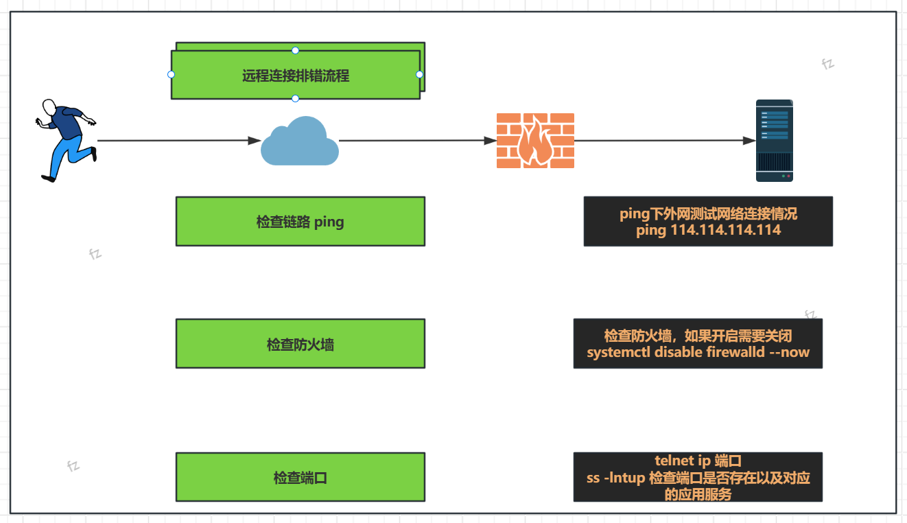

## 1、日常工作总结

### 1.1、之前复盘

- 知识库+思维导图
- 2个思维导图需要做
  - 第1个:知识点汇总
  - 第2个:命令/符号/快捷键/操作

### 1.2、今日内容

- linux优化
- linux配置下载源(系在地址)安装常用的工具
- 系统配置命令行颜色
- 配置远程连接端口号,准许/禁止root登录/修改root密码
- 画图

## 2、Linux下载加速与工具安装

- 要求：物理机，虚拟化环境比作的，***`云服务器`***可以不用配置
- 目标：linux下载安装软件默认从官网下载，修改下载地址统一改为国内

- 操作：2类，红帽类系统，debian/ubt系统

老师语雀笔记：https://www.yuque.com/lidao996/sre/abffhheqc7e7qgex?singleDoc#

- 红帽类系统重下载安装软件的命令：yum
- 红帽重yum下载地址存放在/etc/yum.repos.d/目录下,以.repo结尾

```sh
root@fz:~# cd /etc/yum
yum/         yum.repos.d/ 
root@fz:~# cd /etc/yum.repos.d/
root@fz:/etc/yum.repos.d# ls
kylin_x86_64.repo
```


### 2.、麒麟yum源配置

麒麟系统还需要增加yum源,从而实现可以下载更多元的软件

- 1. 打开网址:https://mirrors.aliyun.com/repo/
- 2. 找到epel-7.repo,右键复制链接地址:https://mirrors.aliyun.com/repo/epel-7.repo


- 3. 在虚机内依次输入下列命令即可

```sh
# 下载源
wget -O https://mirrors.aliyun.com/repo/epel-7.repo
# 清楚缓存和软件包
yum makecache && yum clean all
# 更新最新资源包
yum update
```

- 4. 安装工具

  ```sh
  yum install -y    tree telnet  vim wget  bash-completion    lrzsz  net-tools sysstat  iotop iftop htop unzip nc nmap telnet bc  psmisc httpd-tools  bind-utils nethogs expect
  ```


- `tree`：可以查看目录层次

```sh
tree -L 2 /var	#查看/var/下两层目录信息 -L指定层级
```


### 2.2、debian/ubt 安装apt源

debian/ubt下载安装软件的命令:apt

```sh
#0.切换root用户
sudo su -

#1.备份/etc/apt/sources.list文件 到/tmp/
cp /etc/apt/sources.list  /tmp/

#2.vim编辑/etc/apt/sources.list 文件
dG #vi/vim快捷键 删除当前行到最后一行的内容.
```

配置来源

```sh
deb https://mirrors.aliyun.com/ubuntu/ jammy main restricted universe multiverse
deb-src https://mirrors.aliyun.com/ubuntu/ jammy main restricted universe multiverse

deb https://mirrors.aliyun.com/ubuntu/ jammy-security main restricted universe multiverse
deb-src https://mirrors.aliyun.com/ubuntu/ jammy-security main restricted universe multiverse

deb https://mirrors.aliyun.com/ubuntu/ jammy-updates main restricted universe multiverse
deb-src https://mirrors.aliyun.com/ubuntu/ jammy-updates main restricted universe multiverse

# deb https://mirrors.aliyun.com/ubuntu/ jammy-proposed main restricted universe multiverse
# deb-src https://mirrors.aliyun.com/ubuntu/ jammy-proposed main restricted universe multiverse

deb https://mirrors.aliyun.com/ubuntu/ jammy-backports main restricted universe multiverse
deb-src https://mirrors.aliyun.com/ubuntu/ jammy-backports main restricted universe multiverse
```

安装工具

```sh
#3.执行apt update 生成本地软件包缓存,如果不执行则下载软件失败.
apt update 

#4.安装软件
apt install -y tree  telnet  vim   lrzsz   wget    unzip 

#5.趣味软件
apt install -y cmatrix lolcat  nyancat screenfetch  libaa-bin

nyancat 彩虹猫
lolcat
cmatrix
screenfetch 信息展示
aafire 
```


## 3、命令行颜色

https://www.yuque.com/lidao996/sre/abffhheqc7e7qgex?singleDoc# 《Linux基础优化与常用软件包说明》  


## 4、关闭防火墙

| 防火墙功能 | 作用说明                                                     | 应用                                                         |
| ---------- | ------------------------------------------------------------ | ------------------------------------------------------------ |
| firewalld  | 红帽系统,默认就有默认开启                                    | 1.先关闭后期讲解规则<br />2.未来讲解防火墙后根据需求配置规则 |
| ufw        | ubuntu防火墙 全程:ubuntu firewalld                           |                                                              |
| selinux    | 大部分linux系统都有<br />美国国家安全局开发的,对linux系统增强安全 | 关闭(麒麟中默认关闭了,ubt默认没有安装)                       |

### 4.1、防火墙关闭

#### 4.1.1、firewalld

```sh
# 使用systemctl指令管理
systemctl control
# linux服务管理指令(服务管理:开/关/重启/开机自启动/开机不起启动)


# 1.查看服务状态
systemctl status firewalld

# 2.关闭防火墙
systemctl stop firewalld

# 3.启动防火墙
systemctl start firewalld

# 4.重启防火墙
systemctl restart firewalld

# 5.禁用防火墙(禁止开机启动)
systemctl stop firewalld
systemctl disable firewalld
systemctl disable firewalld --now # 上两步的组合

# 6.开机自启动
systemctl start firewalld
systemctl enable firewalld
systemctl disable firewalld --now # 上两步的组合
```

#### 4.1.2、uwf

ubuntu系统的防火墙

```sh
# 1.查看服务状态
systemctl status ufw

# 2.关闭防火墙
systemctl stop ufw

# 3.启动防火墙
systemctl start ufw

# 4.重启防火墙
systemctl restart ufw

# 5.禁用防火墙(禁止开机启动)
systemctl stop ufw
systemctl disable ufw
systemctl disable ufw --now # 上两步的组合

# 6.开机自启动
systemctl start ufw
systemctl enable ufw
systemctl disable ufw --now # 上两步的组合
```


## 5、openssh服务配置

### 5.1、远程连接服务 `openssh_sever`

> oepnssh就是远程服务,服务名字叫sshd
>
> 1. 修改远程连接端口
>
> 2. ubt系统root,禁止root远程登录

- openssh-server服务配置文件/etc/ssh/sshd_config

- | sshconfig的内容                    |                                                              |
  | ---------------------------------- | ------------------------------------------------------------ |
  | Port 22                            | 修改ssh端口号,端口范围1~65535,推荐修改10000以上              |
  | #PermitRootLogin prohibit-password | 右边不是yes,其实就是禁止root登录,ubuntu默认禁止root远程登录,需要改为`PermitRootLogin yes` |

  

```sh
# 1.修改sshd配置文件
vim /etc/ssh/sshd_config
# 2.修改Port 22的行
Port 6666 # 取消注释
# 3.重启服务
systemctl restart sshd

# 4.检查端口号
ss -lntup


# 因为ubuntu24.04版本修改了重启sshd服务的方法,所以直接重启ssh即可
systemctl restart ssh
```

### 5.2、ss -lntup命令


#### 5.2.1、`ss -lntup` 命令详解

`ss`（Socket Statistics）是 Linux 系统中用于查看 **网络套接字连接状态** 的工具，比传统的 `netstat` 更高效，直接读取内核数据，适用于端口监控、网络故障排查等场景。

```sh
ss [选项] [过滤条件]
# 例子
ss -lntup | grep ":80"
```

#### 5.2.2、**常用选项**

| **选项** |                **作用**                |
| :------: | :------------------------------------: |
|   `-l`   |    仅显示监听（LISTEN）状态的套接字    |
|   `-n`   |   禁用域名解析，直接显示 IP 和端口号   |
|   `-t`   |            仅显示 TCP 连接             |
|   `-u`   |            仅显示 UDP 连接             |
|   `-p`   | 显示占用端口的进程信息（PID 和程序名） |
|   `-a`   |       显示所有连接（包括未监听）       |
|   `-4`   |            仅显示 IPv4 连接            |
|   `-6`   |            仅显示 IPv6 连接            |

#### 5.2.3、`ss -lntup` 输出解析

执行 `ss -lntup` 后，输出结果类似如下格式：

| **Netid** | **State** | **Recv-Q** | **Send-Q** | **Local Address:Port** | **Peer Address:Port** |             **Process**              |
| :-------: | :-------: | :--------: | :--------: | :--------------------: | :-------------------: | :----------------------------------: |
|   `tcp`   | `LISTEN`  |    `0`     |   `128`    |      `0.0.0.0:22`      |      `0.0.0.0:*`      |   `users:(("sshd",pid=1234,fd=3))`   |
|   `udp`   | `UNCONN`  |    `0`     |    `0`     |      `0.0.0.0:68`      |      `0.0.0.0:*`      | `users:(("dhclient",pid=5678,fd=6))` |

|        **字段**        |                      **含义**                       |
| :--------------------: | :-------------------------------------------------: |
|       **Netid**        |               协议类型（`tcp`/`udp`）               |
|       **State**        | 套接字状态（`LISTEN` 表示监听，`ESTAB` 表示已连接） |
|       **Recv-Q**       |             接收队列中的数据量（字节）              |
|       **Send-Q**       |             发送队列中的数据量（字节）              |
| **Local Address:Port** |   本地监听的 IP 和端口（`0.0.0.0` 表示所有网卡）    |
| **Peer Address:Port**  |       远程连接的 IP 和端口（`*` 表示未连接）        |
|      **Process**       |          占用该端口的进程（PID 和程序名）           |

### 5.3、ssh远程连接故障

检查网络--->关闭防火墙---> 检查端口

```sh
# 1.ping检查网络
ping baidu.com

# 2.防火墙关闭
systemctl disable firewalld --now

# 3.telnet 检查端口
telnet 10.0.0.200 3366
# 4.检查是否准许root登录
vim /etc/ssh_sshd
# 修改
Port 3366
PermitRootLogin yes
```



## 6、命令行颜色

https://www.yuque.com/lidao996/sre/abffhheqc7e7qgex?singleDoc# 
《Linux基础优化与常用软件包说明》  

## 7、今日工作总结

- 给linux配置yum/apt源,安装常用工具
- 修改命令行颜色
- 关闭防火墙
- 知悉openssh配置文件,修改ssh远程连接端口号,准许root远程登录


课后作业:

按照下列的参考图绘画自己的思维导图和绘图

https://www.processon.com/view/link/680decc488cde564fcae5414?cid=680de9006b467178ba802d03
https://www.processon.com/view/link/680decd6fcbf554e395d3816
https://www.processon.com/view/link/680b5b6dfcbf554e395a4e47
https://www.processon.com/view/link/680decf29346680abcb5dbd7 


