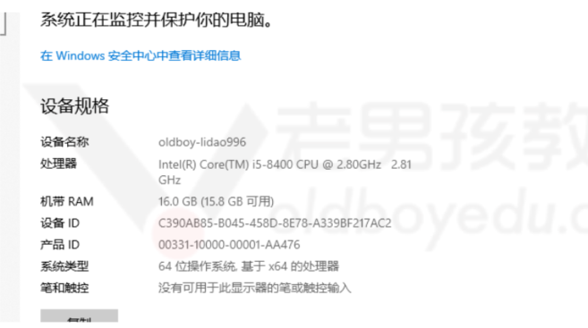
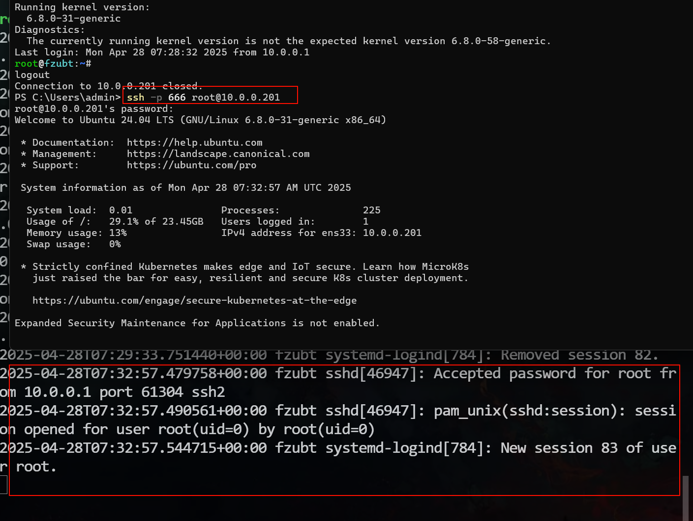

## 1、日常工作总结

### 1.1、昨日复盘

- yum源配置,麒麟yum(repo),ubuntu是apt,在阿里云查找
- 防火墙
  - ubt是ufw,
  - 麒麟是firewalld
  - systemctl服务的运用:
    - systemctl restart(重启服务)
    - systemctl start(启动服务)
    - systemctl stop(停止服务)
    - systemctl disable(禁用服务)
    - systemctl enable(开机自启动)
    - 组合运用 systemctl enable(或者disable) --now ufw
- openssh服务,配置文件是sshd_config,ssh远程连接的端口是22,准许root登录是PermitRootLogin yes
- ss -lntup 查询端口运行状态,以及占用该端口的进程和IP
- 修改命令行颜色

### 1.2、今日内容

- Linux核心文件
- 巡检监控


## 2、核心文件

### 2.1、/etc/下的核心内容

#### 2.1.1、etc/os-release

系统版本信息文件，这个文件仅查看即可,不要修改

```sh
#	麒麟
cat /etc/os-release 
#NAME,ID系统发型版本的名字
NAME="Kylin Linux Advanced Server"
VERSION="V10 (Lance)"
ID="kylin"
VERSION_ID="V10"	# 版本
PRETTY_NAME="Kylin Linux Advanced Server V10 (Lance)"
ANSI_COLOR="0;31"


# rocky
NAME="Rocky Linux"
VERSION="9.5 (Blue Onyx)"
ID="rocky"
ID_LIKE="rhel centos fedora"
VERSION_ID="9.5"
PLATFORM_ID="platform:el9"
PRETTY_NAME="Rocky Linux 9.5 (Blue Onyx)"
ANSI_COLOR="0;32"
LOGO="fedora-logo-icon"
CPE_NAME="cpe:/o:rocky:rocky:9::baseos"
HOME_URL="https://rockylinux.org/"
VENDOR_NAME="RESF"
VENDOR_URL="https://resf.org/"
BUG_REPORT_URL="https://bugs.rockylinux.org/"
SUPPORT_END="2032-05-31"
ROCKY_SUPPORT_PRODUCT="Rocky-Linux-9"
ROCKY_SUPPORT_PRODUCT_VERSION="9.5"
REDHAT_SUPPORT_PRODUCT="Rocky Linux"
REDHAT_SUPPORT_PRODUCT_VERSION="9.5"

#ubuntu
PRETTY_NAME="Ubuntu 24.04 LTS"
NAME="Ubuntu"
VERSION_ID="24.04"
VERSION="24.04 LTS (Noble Numbat)"
VERSION_CODENAME=noble
ID=ubuntu
ID_LIKE=debian
HOME_URL="https://www.ubuntu.com/"
SUPPORT_URL="https://help.ubuntu.com/"
BUG_REPORT_URL="https://bugs.launchpad.net/ubuntu/"
PRIVACY_POLICY_URL="https://www.ubuntu.com/legal/terms-and-policies/privacy-policy"
UBUNTU_CODENAME=noble
LOGO=ubuntu-logo
```

#### 2.1.2、/etc/hostname

- 主机名的配置文件，不推荐直接修改，如果修改了需要重启后才能生效，查询详细信息的时候再使用，平时查询系统信息使用os-release即可！

```sh
# 查询主机配置信息
hostnamectl 

Static hostname: fzubt		#主机名
       Icon name: computer-vm	
         Chassis: vm 🖴
      Machine ID: 632691f0cc3346b9a93de5d373b21144
         Boot ID: bba74f149b534b2d8c73d80e177cef7e
  Virtualization: vmware	#虚拟化技术
Operating System: Ubuntu 24.04 LTS     #系统版本           
          Kernel: Linux 6.8.0-31-generic	#内核版本
    Architecture: x86-64	#cpu架构指令集
 Hardware Vendor: VMware, Inc.
  Hardware Model: VMware Virtual Platform
Firmware Version: 6.00
   Firmware Date: Thu 2020-11-12
    Firmware Age: 4y 5month 2w 1d  
```

> 各系统的内核版本：
>
> 麒麟VV10 SP3：4.19
>
> ubt 24.04： Linux 6.8.0-31-generic    
>
> rocky9.3：5.14
>
> centos7 3.10版本
>
> linux内核官网：[https://kernel.org/](https://kernel.org/)


> Architecture作为扩展
>
> 它是cpu架构（指令集）：
>
> x86-64使用最多（个人，企业），主要是Intel和AMD的cpu，复杂指令集（CISC）
>
> arm架构的cpu，手机（移动端），功能较低，性能可以，arm的cpu用于服务器，精简的指令集，将指令写到cpu硬件中直接调用（RISC）




#### 2.1.3、修改主机名

- 修改后需要重新远程连接或者重新登录

```sh
修改/etc/hostname文件，当前命令行生效
hostnamectl set-hostname yydsfz666

```

- 主机名的规则
  1. 看见主机名就知道服务器作用
  2. 例如 share01.linux66.cn
  3. 其他规则，功能缩写，所有机器要统一规则

- hostname命令（临时修改主机名，重启后失效，一般作为测试）

```sh
hostname test

hostnamectl

# 输出结果，还是没有改变
Static hostname: kylin-V10SP3-fz
   
# 使用它查看主机名会更方便
hostname
```

#### 2.1.4、network网卡配置文件

- 麒麟或红帽系列等系统

- numtui等于修改网卡的配置文件/etc/sysconfig/network-scripts/ifcfg-ens33

```sh
cat /etc/sysconfig/network-scripts/ifcfg-ens33 
```

|  字段名   |                  值                  |                             注释                             |
| :-------: | :----------------------------------: | :----------------------------------------------------------: |
|   TYPE    |               Ethernet               |                            以太网                            |
| BOOTPROTO |                 none                 | 网卡获取IP的方式 none等于static静态固定的地址，也可以修改为dhcp自动获取（dhcp获取时IP地址的行需要删除） |
|   NAME    |                ens33                 |                           网卡名称                           |
|  DEVICE   |                ens33                 |                           网卡名称                           |
|   UUID    | a6b55b3c-4731-4658-867d-f5539ad1a98b |                       全世界唯一识别ID                       |
|  ONBOOT   |                 yes                  |                          开机自启动                          |
|  IPADDR   |              10.0.0.200              |     IP地址 范围一般是最后一位3~254，IP不能重复否则会冲突     |
|  PREFIX   |                  24                  |                           子网掩码                           |
|  GATEWAY  |               10.0.0.2               | 网关地址一般为路由器或交换机，负责管理网络的IP地址 如果IP地址ping不通的时候可以试着ping下网关是否正常 |
|   DNS1    |              223.5.5.5               |      域名解析，把域名转换为IP，一般为公网IP或者局域网IP      |
|   DNS2    |              223.6.6.6               |                         可以多个DNS                          |

> DNS：域名解析服务  例如：jd.cn/taobao.com 将域名解析为IP
>
> 网卡配置文件：dns服务器的ip（公共的DNS服务器，也可以搭建公司内部自用的DNS）
>
> 阿里云DNS：223.5.5.5,223.6.6.6
>
> 114DNS：114.114.114.114,114.114.115.115
>
> 排错的时候可以更改公网DNS测试，如果更改后网络正常，那说明之前的DNS存在问题
>
> DNS查询网址：https://ip138.com/

##### 2.1.4.1、麒麟

```sh
cat /etc/sysconfig/network-scripts/ifcfg-ens33 

TYPE=Ethernet
BOOTPROTO=static
NAME=ens33
UUID=a6b55b3c-4731-4658-867d-f5539ad1a98b
DEVICE=ens33
ONBOOT=yes
IPADDR=10.0.0.200	#修改IP
PREFIX=24
GATEWAY=10.0.0.2
IPV6_PRIVACY=no
DNS1=223.5.5.5
DNS2=223.6.6.6


# 重启网卡
ifdown ens33 && ifup ens33
# 重启网络服务
systemctl restart network
```


##### 2.1.4.2、ubt

```sh
cat /etc/netplan/50-cloud-init.yaml 
# network: {config: disabled}
network:
    ethernets:
        ens33:
            addresses:
            - 10.0.0.201/24	#修改IP
            nameservers:
                addresses:
                - 223.5.5.5
                - 223.6.6.6
                search: []
            routes:
            -   to: default
                via: 10.0.0.2
    version: 2
    
    
# 重启网卡服务，结果会有警告，忽略即可
netplan apply
# 重新加载网络服务
networkctl reload
```


##### 2.1.4.3、rocky

```sh
cat /etc/NetworkManager/system-connections/ens33.nmconnection 

# 配置文件
[connection]
id=ens33
uuid=12cc74df-2fc1-3e1a-9161-688249df1010
type=ethernet
autoconnect-priority=-999
interface-name=ens33
timestamp=1745427454

[ethernet]

[ipv4]
address1=10.0.0.202/24,10.0.0.2	#修改IP
dns=223.5.5.5;223.6.6.6;
method=manual

[ipv6]
addr-gen-mode=eui64
method=auto

[proxy]


# 禁用再启用网卡（以 ens192 为例）
sudo nmcli connection down ens192 && sudo nmcli connection up ens192

# 或直接使用 reload 命令
sudo nmcli connection reload
sudo nmcli connection up ens192
```

#### 2.1.5、/etc/motd和/etc/issue

- 显示系统的基本信息
- /etc/issue文件需要清空，因为会在用户登录系统前就显示器，一般本地连接

```sh
# 清空信息
echo >/etc/issue #给个空值就覆盖清空了
>/etc/issue
```

- /etc/motd配置下欢迎信息，内容会在登录系统后输出，

趣味的欢迎信息：https://www.yuque.com/lidao996/sre/vw00b434kl1ygl95

#### 2.1.6、/etc/hosts

域名与IP对应的关系，本地使用的DNS

```sh
ip 域名	jd.com
# 配置后，域名就会解析为对应的IP 域名-->解析-->IP
# DNS是全局的，hosts文件修改后只在本机生效，不影响其他机器
```

hosts配置流程解析图


windows hosts文件修改测试

```sh
C:\Windows\System32\drivers\etc\hosts
```

- 主要用于测试环境使用（开发测试使用）
- 搭建网站测试环境，修改还hosts文件访问环境
- 修改linux和windows的hosts文件

2.1.7、/etc/fstab

- 开机自动挂载，启动启动磁盘分区

2.1.8、etc/profile或.bashrc

- 配置环境变量，例如此前的修改命令行颜色

### 2.2、/var/log

> log日志：服务软件，系统运行的记录
>
> 日志默认在/var/log目录下存放

看日志抓住关键提示：`failed/Password` 密码失败 `failure`

```sh
ssh命令，ssh服务的可无端远程连接工具（命令）
ssh -p 端口号 用户名@ip

tail 查看结尾的信息 默认看10行
tail -f 查看文件默认的实时记录
```

| 日志文件       | 系统用户登录日志  | 系统日志（启动，服务默认日志） |
| -------------- | ----------------- | ------------------------------ |
| 红帽类系统     | /var/log/secure   | /var/log/messages              |
| ubt/debian系统 | /var/log/auth.log | /var/log/syslog                |



### 2.3、/proc/

#### 2.3.1、目录信息介绍

- 存放各种服务软件的进程信息、内核信息（配置）
- 相当于是给内存开了个入口，进程的内存信息
- 展示的是内存中信息，目录本身不占用磁盘空间
- 一切皆文件

内存和硬盘解释：

- 内存：运行内存，运行程序软件的地方
- 磁盘/硬盘：存放数据的地方


| proc目录名称       | 说明                              |      |
| ------------------ | --------------------------------- | ---- |
| 只用数字命名的目录 | 进程信息，数字是进程的编号（PID） |      |
| /proc/cpuinfo      | cpu硬件信息                       |      |
| /proc/meminfo      | 内存信息                          |      |
| /proc/loadavg      | 负载信息（linux系统繁忙程度）     |      |


#### 2.3.2、CPU硬件信息

##### 查看cpu信息参数文件

```sh
cat /proc/cpuinfo
```


每行信息的说明

|     **字段**      |        **含义**         |                         **补充说明**                         |
| :---------------: | :---------------------: | :----------------------------------------------------------: |
|  ⚠️**processor**   |      逻辑核心编号       | 从0开始计数，用于标识系统中存在几个逻辑处理器（含超线程虚拟核心） |
|   **vendor_id**   |        CPU制造商        |    例如 `GenuineIntel` 表示英特尔，`AuthenticAMD` 表示AMD    |
|  **cpu family**   |       CPU家族代号       | 英特尔CPU家族编号，用于区分不同代际的处理器架构（如家族6对应Intel Core系列） |
|     **model**     |        型号代号         | 与 `cpu family` 配合使用，精确标识处理器型号（如183对应第13代酷睿Raptor Lake架构） |
|  **model name**   |      完整型号名称       | 包含品牌、型号和基础频率（如`Intel(R) Core(TM) i9-14900HX`） |
|   **stepping**    |       步进版本号        |      用于标识CPU的硬件修订版本（数值越大代表版本越新）       |
|   **microcode**   |        微码版本         | 用于修复硬件漏洞的固件补丁（`0xffffffff`表示未加载或不可用）[^搜索结果未明确提及] |
|    **cpu MHz**    |    当前核心运行频率     | 动态值，随负载变化（示例中2419.199MHz为实时频率，非最大睿频） |
|  **cache size**   |   三级缓存(L3)总容量    |           示例中36864KB=36MB，与i9-14900HX规格一致           |
| ⚠️**physical id**  |       物理CPU编号       |       多路CPU系统中标识物理处理器（单CPU系统始终为0）        |
|   **siblings**    | 单个物理CPU的逻辑核心数 | 若启用超线程，此值为物理核心数×2（示例中为1，可能因虚拟化环境限制） |
|    **core id**    |      物理核心编号       |       标识物理核心在CPU内的位置（多核CPU中可能不连续）       |
|   **cpu cores**   |      物理核心总数       | 示例中显示1核，与i9-14900HX实际24核不符，可能因虚拟化环境或配置错误导致 |
|    **apicid**     | 高级可编程中断控制器ID  |         用于多核系统的中断路由（每个逻辑核心ID唯一）         |
|      **fpu**      |  是否支持浮点运算单元   |                   `yes`表示内置浮点处理器                    |
|     **flags**     |    CPU支持的功能特性    | 关键特性包括： - `avx2`：256位向量指令 - `sha_ni`：SHA加密指令 - `hypervisor`：虚拟化支持 |
|     **bugs**      |      已知硬件漏洞       | 列出受影响的漏洞（如`spectre_v2`表示受幽灵漏洞V2影响）[^搜索结果未明确提及] |
|   **bogomips**    |      粗略性能指标       |  通过简单循环计算的估值（示例4838.39约等于每秒48亿次指令）   |
| **address sizes** |    物理/虚拟地址位宽    |   示例支持45位物理地址（最大128TB）和48位虚拟地址（256TB）   |

##### 指令`lscpu`

```sh
lscpu

# 输出结果如下
架构：                           x86_64
CPU 运行模式：                   32-bit, 64-bit
字节序：                         Little Endian
Address sizes:                   45 bits physical, 48 bits virtual
CPU:                             1
在线 CPU 列表：                  0
每个核的线程数：                 1
每个座的核数：                   1
座：                             1
NUMA 节点：                      1
厂商 ID：                        GenuineIntel
CPU 系列：                       6
型号：                           183
型号名称：                       Intel(R) Core(TM) i9-14900HX
步进：                           1
CPU MHz：                        2419.199
BogoMIPS：                       4838.39
超管理器厂商：                   VMware
虚拟化类型：                     完全
```

#### 2.3.3、查看Mem内存信息

##### 2.3.3.1、查看内存的信息

```sh
cat /proc/meminfo
# 通用查看指令
free -h
```

|    **字段**    | **中文翻译** |                         **详细说明**                         | **示例值（Mem/Swap）** |
| :------------: | :----------: | :----------------------------------------------------------: | :--------------------: |
|   **total**    |    总内存    | **Mem**：物理内存总量（包括操作系统预留部分） **Swap**：交换分区总大小（磁盘上的虚拟内存空间） | Mem: 932Mi Swap: 2.0Gi |
|    **used**    |  已使用内存  | **Mem**：包含应用程序占用 + 部分缓存/缓冲区（并非全部不可回收） **Swap**：当前已使用的交换空间（示例中极少使用） | Mem: 219Mi Swap: 11Mi  |
|    **free**    |   空闲内存   | **Mem**：未被任何进程或缓存占用的物理内存 **Swap**：剩余可用的交换空间（示例中充足） | Mem: 232Mi Swap: 2.0Gi |
|   **shared**   |   共享内存   |            多进程共享的内存（如共享库、IPC通信）             |       Mem: 17Mi        |
| **buff/cache** | 缓存和缓冲区 | **buffers**：块设备I/O缓存（如磁盘写入暂存） **cache**：文件系统缓存（加速文件读取） |       Mem: 479Mi       |
| **available**  |   可用内存   | 估算新进程可分配的内存（`free` + 可回收的缓存） **关键指标**：若接近0需警惕内存不足 |       Mem: 539Mi       |

> 内存信息的参考网站：https://www.linuxatemyram.com/


#### 2.3.4、loadavg平均负载

##### 2.3.4.1、查看负载信息

```sh
# 查看负载命令：w
root@kylin-V10SP3-fz:~# w
 20:32:22 up 1 day,  9:37,  2 users,  load average: 0.00, 0.00, 0.00
USER     TTY        LOGIN@   IDLE   JCPU   PCPU WHAT
root     tty1      17:46    2:45m  0.07s  0.07s -bash
root     pts/1     15:12    0.00s  0.73s  0.00s w
```

##### 2.3.4.2、怎么知道负载情况

```sh
load average: 0.00, 0.00, 0.00
			  最近1分钟 最近5分钟 最近15分钟
			  			  
# 与cpu核心总数对比，目前是1，超过1肯定就是忙的
root@kylin-V10SP3-fz:~# lscpu 
CPU:                             1
```


## 3、核心文件总结

- 检查linux版本信息，内核信息：hostnamectl，/etc/os-release
- 检查于修改主机名信息
- cpu架构：x86，arm
- 查看和修改网卡信息：麒麟，ubt
- hosts作用理解即可，如何修改hosts（linux，windows）
- 日志文件secure，auth.log检查是否有密码失败
- proc下面内容，cpu硬件信息，内存信息，负载信息（lscpu，free，w）

了解：motd，issue
