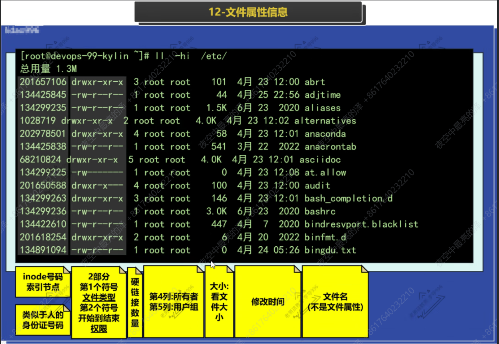
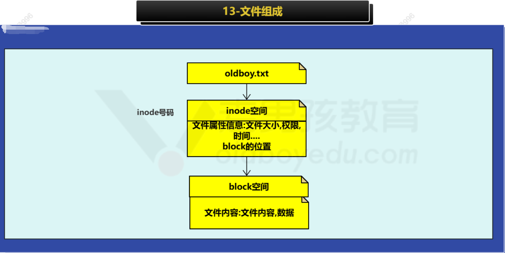
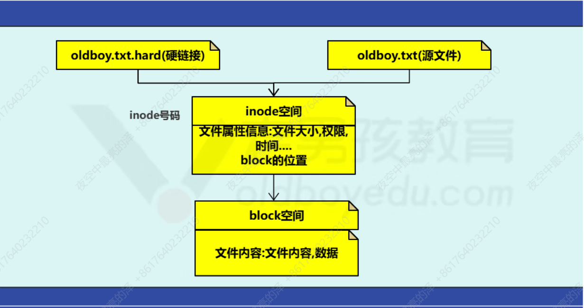
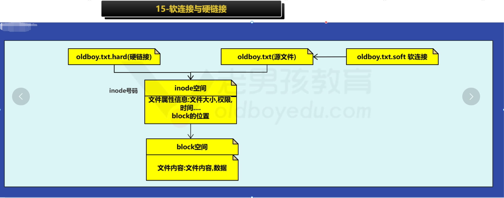

## 1、日常工作总结

### 1.1、上周工作总结


### 1.2、今日工作内容

- 文件类型
- 打包压缩命令
- 时间相关
- 面试题：软硬连接的区别


## 2、文件属性专题

### 2.1、文件属性





### 2.2、文件组成



#### 2.2.1、inode含义


index node 索引节点存放属性信息，例如大小,所有者,权限,时间.....存放了block的位置.


#### 2.2.2、inode特点

> - **定义**：每创建1个新文件就占用1个inode，它的总数量在磁盘分区格式化后固定
> - **查看**：inode总数与剩余数量
> - **故障案例**：inode用光了，磁盘空间不足等


#### 2.2.3、block数据块

> - **定义**：block存放数据的地方（数据实体）
> - **规格**：4k 1个block，大小可以改变，需要格式化后再调整
> - **查看**：block的使用情况，日常看硬盘还有多少空间，一般情况下的磁盘空间不足基本都是block不足

#### 2.2.4、查看磁盘的inode和block

- **简单查看**

```bash
# 1.查看系统所有磁盘的block大小使用情况
df -h

# 2.查看inode号
df -i
```

- **如果空间不足（磁盘空间不足）的排查流程**

```sh
# 1.查看磁盘空间大小
df -h

# 2.检查不足的分区，一层一层的去检查定位到目录或文件
du -sh /* |sort -hrk1|head
du -sh /usr/* |sort -hrk1|head
du -sh /usr/lib/* |sort -hrk1|head

# 3.按照层级检查之后的动作

```

2.3、文件类型

#### 2.3.1、文件类型的分类

| 类型        | 说明                                                         |
| ----------- | ------------------------------------------------------------ |
| `- （f）`   | 文件file                                                     |
| `d`         | 目录 directory                                               |
| `l（link）` | 软连接                                                       |
| `b`         | 块设备 block device 硬盘/磁盘/分区                           |
| `c`         | 字符设备，charcter device 不断输出或吸收字符的设备（类似于黑洞，白洞）/dev/zero 创建指定大小的文件 |

#### 2.3.2、file查看文件目录详细类型

- 文本文件 text 可以查看修改（cat/vim）
- 数据文件 data
- 可执行二进制文件（也就是敲的命令）executable，一般就是命令，直接运行即可

```sh
file /etc/hostname  libunistring-0.9.10-8.ky10.x86_64.rpm  one
#返回结果如下
/etc/hostname:                         ASCII text
libunistring-0.9.10-8.ky10.x86_64.rpm: RPM v3.0 bin i386/x86_64
one:                                   directory
```

- 创建2G的文件测试
- 需要使用/dev/zero文件，不断输出0，这个文件需要结合特定的命令使用
- **🌞dd命令的作用**：创建指定大小的文件，测试磁盘速度

```sh
dd if=/dev/zero of=/var/log/test.txt bs=1M count=2048
```

> **if===input file指定从哪里获取数据（数据源），源头是哪里**
> **of===output file到哪里去（创建的文件保存的地方）**
> **bs===block	size每次读取多少数据**
> **count 循环取次数，如果是2G，结合size每次取1M，需要取2048次**

### 2.4、软连接⭐⭐⭐⭐⭐

- 软连接
- 硬链接

#### 2.4.1、软连接的含义

- 软连接（softlink），符号连接（symlink）

- 作用类似于windows系统下面的快捷方式，方便命令操作

- 存放源文件的路径名字


#### 2.4.2、创建软连接

条件：给/oldboy/oldboy.txt创建软连接/oldboy/oldboy.txt.soft

**🌞1.修改文件内容后，软连接是与源文件数据同步的**

**🌞2.并且删除软连接后不影响源文件**

```sh
touch /oldboy/oldboy.txt
ln -s /oldboy/oldboy.txt /oldboy/oldboy.txt.soft
```


### 2.5、硬链接

**含义：在同一个分区中inode号码相同的文件互为硬链接**



- ln创建硬链接

```sh
vim oldboy.txt
ln oldboy.txt oldboy.txt.haed
ll oldboy.txt
-rw-r--r-- 2 root root 50 May  6 11:42 oldboy.txt
ll oldboy.txt*
-rw-r--r-- 2 root root 50 May  6 11:42 oldboy.txt
-rw-r--r-- 2 root root 50 May  6 11:42 oldboy.txt.haed
ll -i oldboy.txt*
67291904 -rw-r--r-- 2 root root 50 May  6 11:42 oldboy.txt
67291904 -rw-r--r-- 2 root root 50 May  6 11:42 oldboy.txt.haed
```

### 2.6、软硬链接区别



> - **软连接使用最广泛，对文件目录都可以创建**
>
> - **硬链接`只允许`对文件创建**
>
> - **删除源文件，软连接失效后会变红，如果删除软连接没有影响，同时删除软连接和源文件，文件无法访问**
>
> - **如果删除了源文件，随后创建和之前源文件同名的文件还可以使用软连接**


## 3、时间

- 3类/4类时间
- 查看与修改时间的命令

| Linux时间分类     | 说明                                                         |      |
| ----------------- | ------------------------------------------------------------ | ---- |
| 🌞修改时间mtime    | modify修改时间，文件内容修改时最应该关注的                   |      |
| 访问时间atime     | access访问，查看下文件，文件时间的变化，<br />mtime变化后atime才能变化，是有限制的 |      |
| 属性变化时间ctime | 文件属性信息变化的时间                                       |      |
| 创建时间btime     | 需要再新的内核系统中才有                                     |      |

### 3.1、date查看时间

**单独运行date可以查看时间**

```sh
date
```

- **以年-月-日的形式显示当前日期**

- **+表示以xxx格式显示**

```sh
date +%F 相当于 date +%Y+%m-%d
date +%T 相当于 date +%H+%M-%S
date +%w 周几 周1...6 周日为0
```

> 用于创建文件,目录,压缩包.打包备份.

- 组合使用：年-月-日-时间

```sh
date +%F-%T
# 返回结果
2025-05-06-16:31:26
```

### 3.2、date修改时间

```sh
date s '20251111 11:11:11'
```


### 3.3、ntpdate自动同步时间

**虽然可以同步时间但无法修改时区，需要安装ntpdate时间服务器，⚠️需要网络**

```sh
# 先安装ntpdate
yum install -y ntpdate

# ubuntu安装
apt install -y ntpdate

# 最后执行同步指令
ntpdate ntp.aliyun.com
```

### 3.4、timedatectl查看与修改时区

```sh
# 单独运行查看时间信息
timedatectl

# 修改时区
timedatectl set-timezone Asia/Shanghai
```

## 4、解包压缩包

>打包压缩本质就是压缩
>备份通过打包压缩实现即可
>打包相当于是把文件目录放在一起(苹果放在筐里)
>压缩:压缩空间节约空间


| 打包压缩 的命令                                              | 应用场景                                                     |
| ------------------------------------------------------------ | ------------------------------------------------------------ |
| tar命令                                                      | linux日常打包压缩优先使用tar                                 |
| tar 创建 压缩包                                              | zcvf                                                         |
| v显示过程,未来可以省略. z(使用gzip工具压 缩) c(create 打包) f (file 指定压缩包) |                                                              |
| tar zcvf /backup/etc.tar.gz /etc/ zcvf简写为zcf              |                                                              |
| 查看                                                         | tar tf 压缩包 #list列表                                      |
| 解压                                                         | tar xf 压缩包 #extract 解压                                  |
| 解压到指 定目录                                              | tar xf 压缩包 -C 目录                                        |
| zip/unzip                                                    | zip格式压缩包一般用于windows和linux互 传文件使用. 未来我们较少在linux创建zip压缩包,更多的 是通过unzip解压zip压缩包. |
| gzip                                                         | 与特定指定组合. 对配置文件进行注释操作.                      |

### 4.1、tar包

#### 4.1.1、tar压缩包

```sh
#给/etc/目录打包压缩 放在/backup/etc.tar.gz
tar zcvf /backup/etc.tar.gz /etc/

tar zcf /backup/etc.tar.gz /etc/
```

#### 4.1.2、tar查看压缩包

```sh
tar ztvf /backup/etc.tar.gz
tar tf /backup/etc.tar.gz
```

#### 4.1.3、tar解压包

```sh
tar xf /backup/etc.tar.gz
```

#### 4.1.4、tar解压包到指定目录

```sh
tar xf /backup/etc.tar.gz -C /opt/
```


### 4.2、unzip包

#### 4.2.1、unzip解压  

```sh
unzip xxxxx.zip
```

#### 4.2.1、zip压缩

```
zip -qr /backup/etc.zip /etc/

-r压缩目录
-q不要输出
```


**核心tar命令(zcf,tf,xf,-C),unzip解压**  


## 5、今日工作总结

- 文件(属性,数据) inode,block
- 文件类型:file,dir,link
- 软连接,硬链接,软硬连接区别
- 时间,打包压缩  

