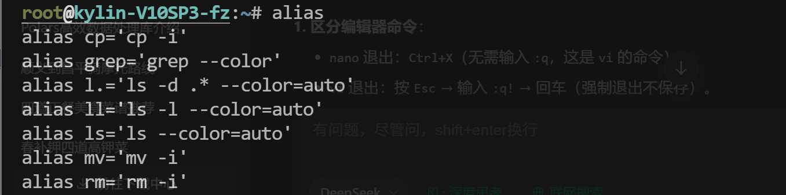
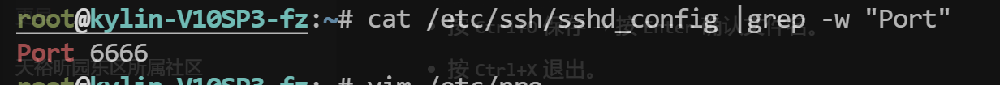
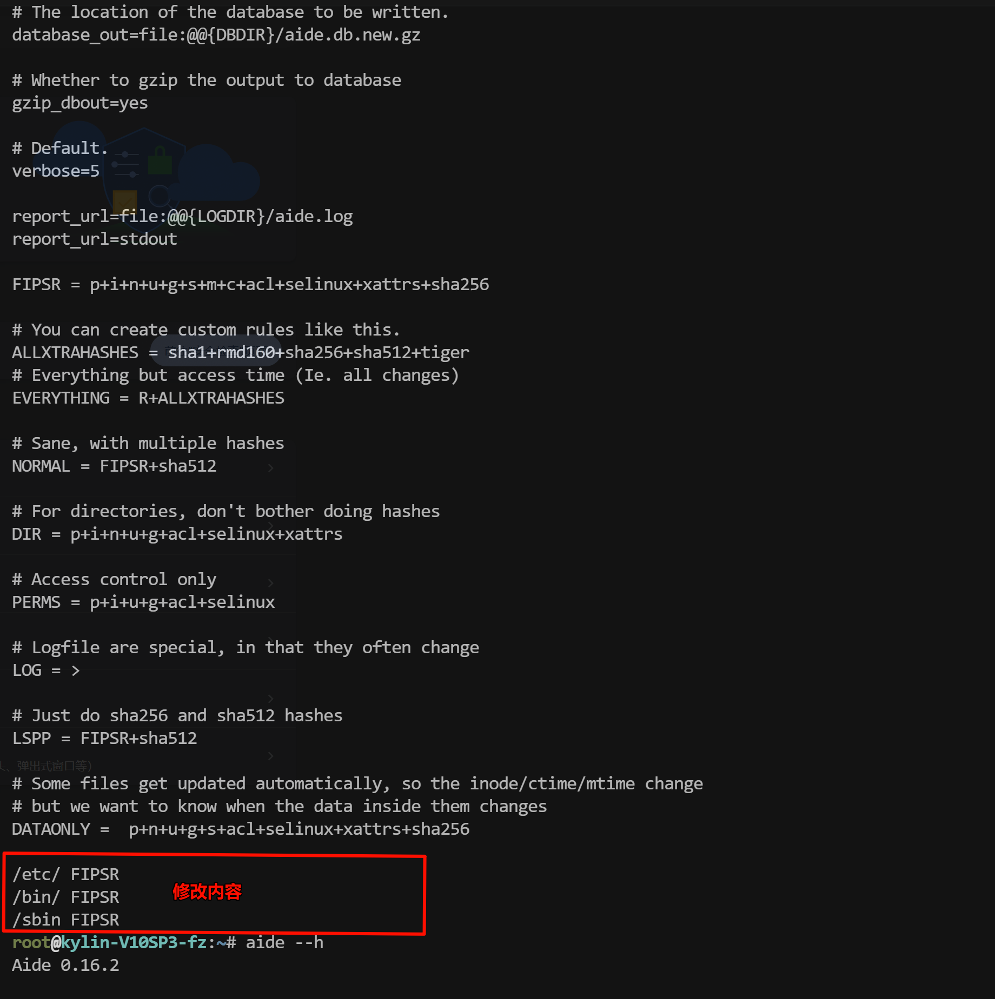
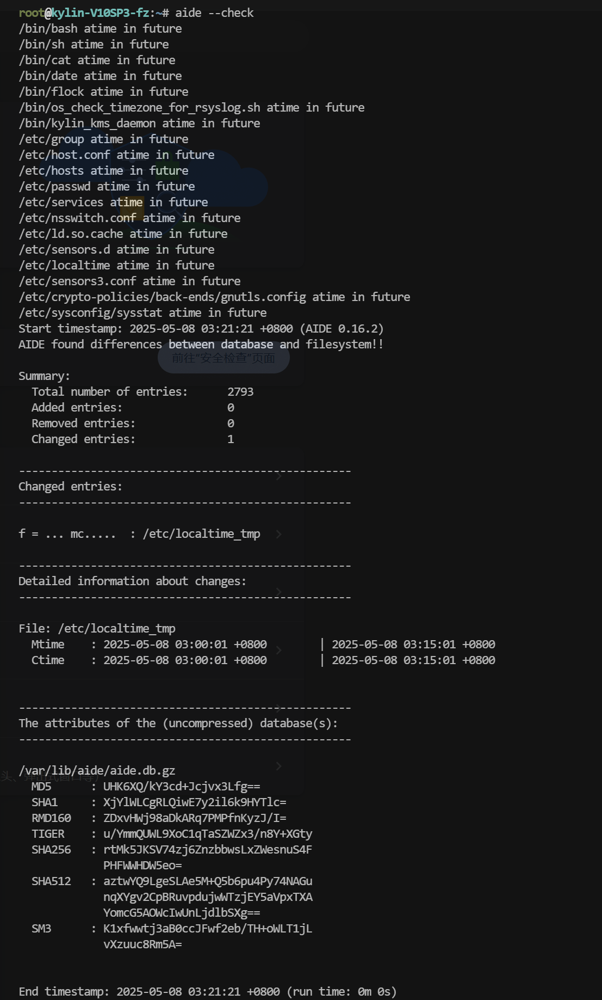
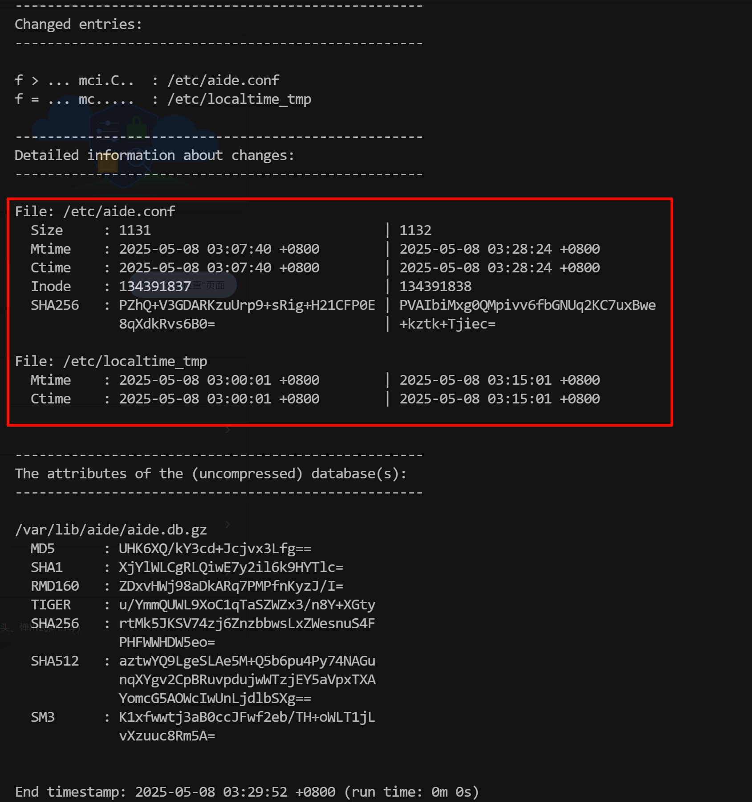
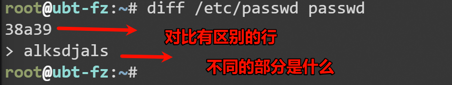
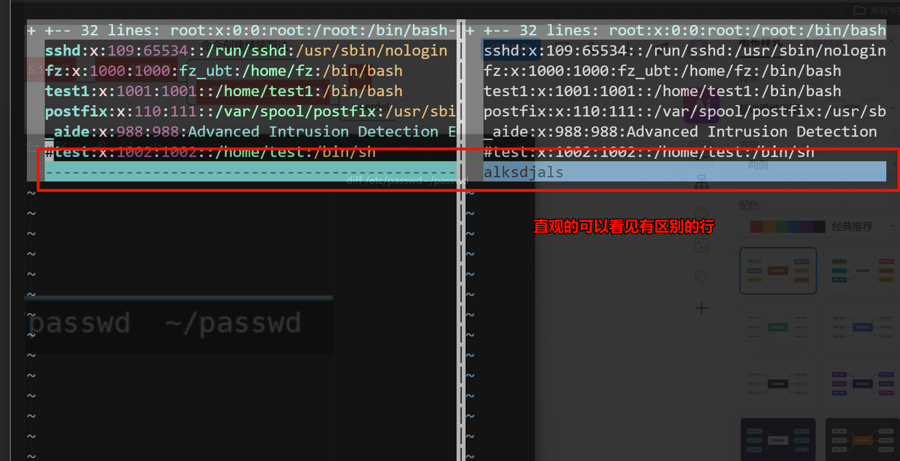
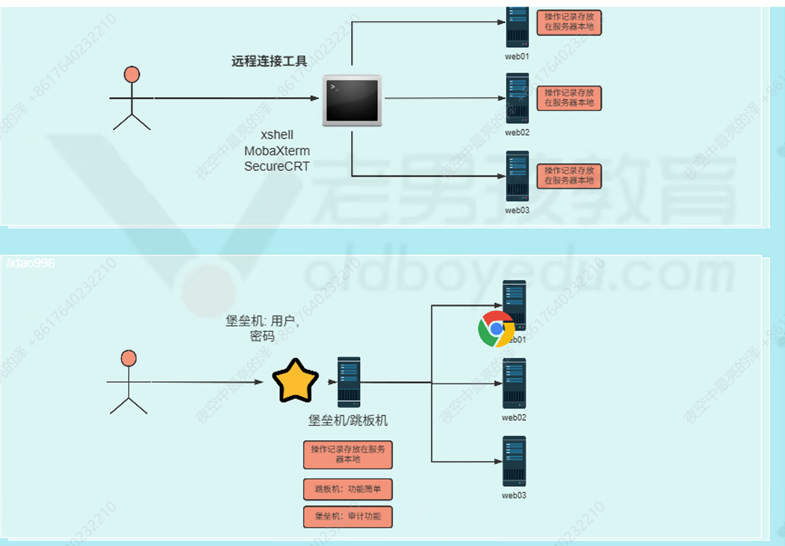

## 1、日常工作总结

### 1.1、上周工作总结


### 1.2、今日工作内容


## 2、Linux系统安全与用户安全

### 2.1、别名

**用于给命令设置便捷的昵称，比如：ll == ls -l或ubt系统中使用grep过滤自动添加颜色**

#### 2.1、应用场景：

- 🅰️命令精简，例如 ：`kubectl = 'kubectl get po'`
- 🅱️给危险命令加上保险

#### 2.1.2、检查别名

```sh
alias
```



#### 2.1.3、配置别名

##### 2.1.3.1、麒麟系统中使用grep命令运行grep --color

- **临时生效：**重新登录后失效

```sh
alias 别名=“命令”
alias grep=‘grep --color’
```

- **永久生效：**写入到对应的文件一般写入到/etc/profile 未尾sh

```sh
# 将文件写入到/etc/profile文件中
alias grep=‘grep --color’
# 生效加载
source /etc/profile
```



#### 2.1.3.2、rm配置别名的坑

给rm配置别名，只要运行rm命令就输出`pls do not use rm cmd,use mv.`

```sh
# 1.临时命令行配置与测试

alias别名='命令'
alias rm='echo pls do not userm cmd,use mv.'

# 测试
rm /oldboy/oldboy.txt 发现无法删除

\rm /oldboy/oldboy.txt 取消别名就可以真的删除了.

# 2.永久写入到/etc/profile配置文件
vim /etc/profile
# 到最后一行写入命令行执行的命令
alias rm='echo pls do not use rm cmd,use mv.'
# 保存退出后
source /etc/profile #生效即可,仅需运行1次.

# 3.编辑~/.bashrc 在alias rm这行开头加上#注释
vim ~/.bashrc
# User specific aliases and functions
#alias rm='rm -i'#<===这行
alias cp='cp -i'
alias mv='mv -i'

#4.完成了.
```

### 2.2、系统校验检查

#### 2.2.1、校验的含义


> 1️⃣
>
> 2️⃣

- **应用场景：**
  - 🅰️检查文件内容是否被改变（新旧对比）
  - 🅱️下载获取的文件是否与官方一致

#### 2.2.2、md5检查文件

```sh
# 1.写入文件内容，然后创建MD5值
echo 'aoligei555' >> test.txt
root@kylin-V10SP3-fz:~# cat test.txt 
aoligei555
root@kylin-V10SP3-fz:~# md5sum test.txt 
9c3bca788385184502a7674ebb22911a  test.txt

#2.MD5指纹信息写入后缀为.md5的文件中
root@kylin-V10SP3-fz:~# md5sum test.txt > test.txt.md5
root@kylin-V10SP3-fz:~# cat test.txt 
aoligei555

# 录入的指纹信息中已经把MD5值和文件名对应
root@kylin-V10SP3-fz:~# cat test.txt.md5 
9c3bca788385184502a7674ebb22911a  test.txt

#3.对比检查，使用-check或-c检查
root@kylin-V10SP3-fz:~# md5sum --check test.txt.md5 
test.txt: OK

# 4.修改文件内容后重新检查会发现失败
root@kylin-V10SP3-fz:~# echo '123' >test.txt
root@kylin-V10SP3-fz:~# md5sum --c test.txt.md5 
test.txt: FAILED
md5sum: WARNING: 1 computed checksum did NOT match
```

**⚠️缺点只能检查文件内容是否变化，无法检查文件属性是否变化**

#### 2.2.3、aide


通过配置文件配置监控目录、文件、监控md5/sha1-5、监控文件属性信息的变化，例如文件被篡改会被检测到


##### 2.2.3.1、安装软件

```
yum install -y aide
```

##### 2.2.3.2、修改配置文件

```sh
ll /etc/aide.conf
#配置文件氛围2个部分
# 1.创建各种健康指标集合
FIPSR = p+i+n+u+g+s+m+c+acl+selinux+xattrs+sha256

p permission 权限
i node 号码
n link 硬链接数量
u user 用户
g group 用户组
s size 大小
m mtime 文件内容变化时间
c ctime 属性变化时间
acl+selinux 特殊权限
xattrs 特殊属性

# 2.指定目录或文件，并搭配上面的集合
# 修改后的内容如下图
```




- 更改后加载生效，根据配置文件生成初始的指纹信息库（压缩包）

```sh
# 执行命令加载生效
aide -i
```


- 修改指纹信息库名称

```sh
mv /var/lib/aide/aide.db.new. gz /var/lib/aide/aide.db.gz
```

- **校验**

```sh
aide --check
```




- 故意修改内容或创建文件的时间

```sh
# 1.进入配置文件内修改信息
vim /etc/aide.conf

# 2.重新加载
aide -i

# 3.检查校验
aide -C
```



#### 2.3.4、diff对比

##### 2.3.4.1、判断两个文件改变后的对比区别

```sh
diff /etc/passwd ~/passwd
```



##### 2.3.4.2、vimdiff

可视化的界面对比直观



**2个命令不同的地方：**

- 就是diff是命令行直接展示，

- vimdiff是打开两个vim文件进行直观的对比，并且带颜色，容易识别查看。


### 2.3、堡垒机（跳板机）

**远程连接linux系统，要经过堡垒机，然后才能连接linux，无法/禁止直接连接，对linux远程连接进行防护/审计（操作记录）**

**跳板机：功能简单**

**堡垒机：功能复杂**



| 堡垒机选型           | 说明                    |      |
| -------------------- | ----------------------- | ---- |
| 开源                 | jumpserver（开源/商业） |      |
| 大型企业一般自己开发 |                         |      |
|                      |                         |      |


## 5、今日工作总结

- 核心:别名配置
- md5理解作用，会使用即可创建指纹文件,进行校验-c
- aide工具.
- 理解堡垒机作用  


****温馨提示:要用纯净的系统(麒麟)并关闭防火墙(基础优化)**
**2核心内存8G**
**https://docs.jumpserver.org/zh/v4/installation/setup_linux_standalone/offline_install/**  

