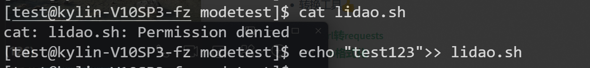

## 1、日常工作总结

### 1.1、昨日工作总结


### 1.2、今日工作内容


- rwx
- 命令
- rwx含义
- 文件rwx
- 目录
- 操作文件/目录提示permission denied权限拒绝故障
- 特殊权限
- 特殊属性


## 2、用户管理/etc/skel目录

- **新用户家目录的模版，类似于房子的样板间**
- **使用场景：**
  - 创建文件/通知。所有新用户都要读取查看的文件
  - 不小心删除家目录的情况，重新创建，重新复制/etc/skel下面的内容

```sh
# 删了当前目录下的隐藏文件，需要恢复

\cp /etc/skel.bash* ~
```


## 3、权限管理

### 3.1、权限管理

- 作用：控制文件或目录的访问权限限制

| 权限 | 说明     | 解释                                        | 数字表达权限 |
| ---- | -------- | ------------------------------------------- | ------------ |
| `r`  | read     | **读取权限，*                               | 4            |
| `w`  | write    | **写入权限/修改权限。是否可以修改文件内容** | 2            |
| `x`  | execute  | **执行权限**                                | 1            |
| `-`  | 没有权限 |                                             | 0            |
| `d`  | dir      | 目录                                        | 7            |

### 3.2、文件目录权限管理


```SH
# 1.检查test用户属于哪个组
root@kylin-V10SP3-fz:~# id test 
uid=1000(test) gid=1000(test) groups=1000(test)

# 2. 过滤/etc/group文件
root@kylin-V10SP3-fz:~# grep root /etc/group
root:x:0:
```

### 3.3、修改权限

- **`chmod` change 改变/修改 mode（权限） 修改用户权限 rwx 655**
- **`chown` change 改变/修改 modowner（权限）修改文件目录所有者的用户组信息**


#### 3.3.1、chomod修改权限

##### 3.3.1.1、使用数字修改权限（推荐）

**使用数字修改文件目录权限，经常使用，需要熟练掌握**

```sh
root@kylin-V10SP3-fz:~# touch 1.txt
root@kylin-V10SP3-fz:~# chmod 755 1.txt
root@kylin-V10SP3-fz:~# ll 1.txt 
-rwxr-xr-x 1 root root 0 May  9 10:24 1.txt
```

#### 


##### 3.3.1.2、使用字母修改权限

##### 使用字母`u、g、o`修改文件目录权限


```sh
# 首先创建个测试文件
root@kylin-V10SP3-fz:~# chmod 000 1.txt 
root@kylin-V10SP3-fz:~# ll 1.txt 
---------- 1 root root 0 May  9 10:24 1.txt

# 1.修改所有者权限
root@kylin-V10SP3-fz:~# chmod u+rw 1.txt
root@kylin-V10SP3-fz:~# ll 1.txt 
-rw------- 1 root root 0 May  9 10:24 1.txt

# 2.修改其他用户权限
root@kylin-V10SP3-fz:~# chmod o+x 1.txt
root@kylin-V10SP3-fz:~# ll 1.txt 
-rw------x 1 root root 0 May  9 10:24 1.txt
root@kylin-V10SP3-fz:~# chmod 000 1.txt
root@kylin-V10SP3-fz:~# ll 1.txt 
---------- 1 root root 0 May  9 10:24 1.txt

# 3.修改所有权限
root@kylin-V10SP3-fz:~# chmod u=rwx,g=rw,o=x 1.txt 
root@kylin-V10SP3-fz:~# ll 1.txt 
-rwxrw---x 1 root root 0 May  9 10:24 1.txt

# 4.给ugo加执行权限的的三种方式
root@kylin-V10SP3-fz:~# chmod ugo+x 1.txt 
root@kylin-V10SP3-fz:~# chmod a+x 1.txt 
root@kylin-V10SP3-fz:~# chmod +x 1.txt 
root@kylin-V10SP3-fz:~# ll 1.txt
---x--x--x 1 root root 0 May  9 10:24 1.txt
```


#### 3.3.2、chown修改所有者和用户组

修改user所有者和group用户组

```sh
chown oldboy.oldboy 文件或目录
chown 所有者.用户组 文件或目录
chown -R 所有者.用户组 文件或目录#递归（Recursive）​​，对目录及其所有子内容生效

#ubt/debian有所不同，需要将.改成:
chown oldboy:oldboy 文件或目录
```


### 3.4、文件rwx权限

**文件创建后的默认权限为644**

| 权限 | 说明     | 解释                                                         |
| ---- | -------- | ------------------------------------------------------------ |
| `r`  | read     | **读取权限，仅查看文件内容的权限**                           |
| `w`  | write    | **写入权限/修改权限。是否可以修改文件内容，需要`r`权限的配合** |
| `x`  | execute  | **执行权限（运行命令和脚本），需要`r`权限的配合（尤其是脚本）** |
| `-`  | 没有权限 |                                                              |
| `d`  | dir      | 目录                                                         |


#### 3.4.1、环境准备

```sh
mkdir -p /oldboy/modetest/
cd /o1dboy/modetest/
chmod +x lidao.sh
echo 'hostname' >> lidao
chown oldboy.oldboy lidao.sh
```


#### 3.4.2、测试

**root修改权限，普通用户测试**

> 1. 只给w
>
> - 文件只能写入无法查看，所以还需要r权限配合
> - vim/vi修改导致原始内容丢失
>
> ```sh
> root@kylin-V10SP3-fz:/oldboy/modetest# chmod u=w lidao.sh 
> root@kylin-V10SP3-fz:/oldboy/modetest# ll
> total 4
> --w-r-xr-- 1 test test 32 May  9 11:10 lidao.sh
> ```
>
> 
>
> 
>
> 2. 只给x
>
> - 如果是shell脚本，只给x执行权限不可以直接执行，得需要r查看权限配合执行
>
> ```sh
> root@kylin-V10SP3-fz:/oldboy/modetest# chmod u=x lidao.sh 
> root@kylin-V10SP3-fz:/oldboy/modetest# ll
> total 4
> ---xr-xr-- 1 test test 24 May  9 10:45 lidao.sh
> ```
>
> 
>
> 
>
> 3. 只给r。只能看不能写入
>
> ```sh
> root@kylin-V10SP3-fz:/oldboy/modetest# chmod u+r lidao.sh 
> root@kylin-V10SP3-fz:/oldboy/modetest# ll
> total 4
> -r----x--x 1 test test 32 May  9 11:10 lidao.sh
> ```
>
> 

​	


### 3.5、目录rwx权限

**目录创建后的默认权限为755**

| 文件权限 | 说明                                       | ⚠️注意事项                                          |
| -------- | ------------------------------------------ | -------------------------------------------------- |
| `r`      | 查看目录内容                               | **需要`x`权限配合使用**                            |
| `w`      | 是否能在目录下增删改查的权限，改就是重命名 | 需要`x`权限配合才能写入，一般也都会给`r`权限来查看 |
| `x`      | 是否能进入目录和查看目录下文件属性的权限   | **需要`r`权限配合使用**                            |
| `-`      | 无权限                                     |                                                    |


#### 3.5.1、环境准备

```sh
mkdir lidaodir
touch {1..10}lidao.txt /lidaodir
chown -R test.test lidaodir
```


### 3.6、文件rwx，目录rwx含义总结⭐⭐⭐⭐⭐


| 权限    | 目录                                                         | 文件                                                         |
| ------- | ------------------------------------------------------------ | ------------------------------------------------------------ |
| **`r`** | **查看目录内容<br />需要`x`权限配合使用**                    | **读取权限，仅查看文件目录内容的权限**                       |
| **`w`** | **是否能在目录下增删改查的权限，改就是重命名<br />需要`x`权限配合才能写入，一般也都会给`r`权限来查看** | **写入权限/修改权限。是否可以修改文件内容，需要`r`权限的配合** |
| **`x`** | **是否能进入目录和查看目录下文件属性的权限<br />需要`r`权限配合使用** | **执行权限（运行命令和脚本），需要`r`权限的配合（尤其是脚本）** |
| **`-`** | **无权限**                                                   |                                                              |

- **案例：**为什么删除不了`lidao.sh`文件？

- **答：**虽然文件拥有全部读写执行权限，但删除需要拥有当前目录的权限配合，通过**`ll`**查看目录发现所有者为**`root`**，所以普通用户无法删除该目录下的文件，必须要修改目录**所有者**为当前的**普通用户**才可删除


### 3.7、权限拒绝

`permission denied`权限拒绝在搭建网站、操作文件或目录会遇到

故障本质是判断用户对文件或目录缺少了什么权限

```sh
root@kylin-V10SP3-fz:~# su - test1

# 1.test1用户对/root/目录缺少rx查看目录下文件属性的权限
[test1@kylin-V10SP3-fz ~]$ ls
[test1@kylin-V10SP3-fz ~]$ ll /root
ls: cannot open directory '/root': Permission denied

# 2.对shadow文件缺少r查看文件内容的权限
[test1@kylin-V10SP3-fz ~]$ ll /etc/shadow
---------- 1 root root 1158 May  9 14:44 /etc/shadow
[test1@kylin-V10SP3-fz ~]$ cat /etc/shadow
cat: /etc/shadow: Permission denied

# 3.缺少rwx创建文件的权限
[test1@kylin-V10SP3-fz ~]$ touch /etc/test.txt
touch: cannot touch '/etc/test.txt': Permission denied
# 4.缺少rwx创建文件的权限
[test1@kylin-V10SP3-fz ~]$ echo "#test" >> /etc/passwd
-bash: /etc/passwd: Permission denied2
# 5.缺少r查看权限
[test1@kylin-V10SP3-fz ~]$ tail /var/log/messages
tail: cannot open '/var/log/messages' for reading: Permission denied
```

### 3.8、12位权限之特殊权限

有三个特殊权限，经常遇到的只有两个，未来不要使用/创建这些特殊权限. 

| 特殊 权限       | 说明                                                         |
| --------------- | ------------------------------------------------------------ |
| `suid setuid`   | 例子:/bin/passwd命令,运行这个命令的时候相 当于获取命令所有者(root)权限 (所有人) |
| `sticky 粘滞位` | /tmp/ 拥有粘滞位的目录,777权限,每个用户只能管理自己创建的文件. |
| `sgid setgid`   | 运行这个命令的时候相当于获取命令用户组 (root)权限 (所有人)   |

### 3.9、特殊属性

- chattr、lasttr linux系统（文件系统属性）

- a属性 append只能追加，一直增加内容，不能修改和删除

- i属性 immutalbe无敌的，不能修改，给命令进行配置

```sh
chattr +i test.txt
chattr -i oldboy.txt
# 查看修改后的权限信息
lsattr
```


### 3.10、umask默认权限

1. **控制系统默认权限，针对新文件或新目录**
2. **umask默认是0022，目录的默认权限为**

> - 新建目录默认权限为777 - 022 =755
> - 新建文件默认权限为666 - 022 =644


## 4、今日总结

- 文件和目录rwx含义. ⭐⭐⭐⭐⭐
- permission denied故障排查,定位的思路.⭐⭐⭐⭐⭐
- chown -R,chmod ⭐⭐⭐⭐⭐
- 特殊属性:chattr,lsattr命令,a属性,i属性.
- 特殊权限:suid,粘滞位了解含义即可.
- 扩展: 一不小心chown/chmod改了根的权限递归,如何拯救  
