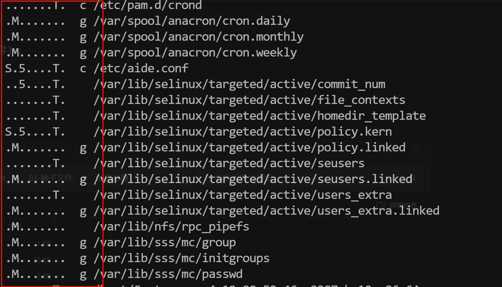

## 1、今日工作

- **Linux下安装软件的方法⭐⭐⭐⭐⭐**

- **软件包管理的命令:yum/apt,rpm/dpkg⭐⭐⭐⭐⭐**
- **红帽类系统:yum命令的配置**
- **红帽,ubt系统:yum源/apt源的配置**
- **方案: 搭建公司内部的源(软件仓库,内网)**


## 2、Linux软件包管理体系

### 2.1、安装软件的方法

| Linux下安装软件的方法 | 说明                                                         | 对比                                           | 企业使用/选型                                                |
| --------------------- | ------------------------------------------------------------ | ---------------------------------------------- | ------------------------------------------------------------ |
| `yum/apt`             | 自动下载软件包和解决依赖并会自动安装，需要网络（公网，局域网需要特别搭建才可以使用）） | 就和点外卖一样，缺少的东西外卖解决             | yum/apt没有特殊要求的时候，yum/apt安装，如果春内网环境，需要搭建内网yum/apt环境 |
| `rpm/deb包`           | 本质与yum类似，类似于windows.exe这样的文件=<br />yum/apt就是下载并替我们安装rpm包/deb包 |                                                | yum/apt无法使用又没用内网yum/apt源时<br />临时使用rpm/deb包安装 |
| `二进制`              | 下载安装好的软件包，解压即可直接使用，类似于绿色软件         | 类似于自嗨锅，自热小火锅一样，依赖需要自己解决 | 软件没有rpm包，也无法yum/apt                                 |
| `[源码]编译`          | 下载这个软件的源代码，通过三大步骤编译安装<br />配置（configure），编译（make），安装（make install） | 类似于做饭步骤：<br />备菜--->炒菜--->上菜     | 没有二进制的时候，编译安装<br />进行自定义安装（修改路径，修改里面的默认配置，增减默认的配置） |

### 2.2、yum

**熟练掌握软件的增删改查**

| 作用   | 命令                                              | 说明                                  |
| ------ | ------------------------------------------------- | ------------------------------------- |
| **增** | `yum install -y`                                  | 安装，一般配合rpm -qa或rpm -ql检查    |
| **查** | `yum provides`                                    | 查询命令或文件属于那个软件包          |
| **删** | `yum remove`<br />推荐使用`rpm -e`                | 删除卸载软件，不要使用yum卸载会丢依赖 |
| **改** | `yum update/yum upgrade`<br />常用为`yum install` | 更新软件包                            |


#### 2.2.1、安装

> 1. **软件包===命令**
> 2. **1个软件包中包含多个命令**

```sh
yum install -y tree telnet lrzsz vim
```


#### 2.2.2、检查安装情况

##### 2.2.2.1、rpm检查

```sh
rpm -qa #显示linux中所有已经安装的软件包

# 1.rpm命令检查
rpm -qa tree telnet lrzsz vim

#2.rpm与grep检查（推荐使用）
rpm -qa |grep telnet
```


##### 2.2.2.2、检查软件包内容

**软件包包含什么、安装到了那里？**

```sh
#服务软件包，查看服务配置文件，配置文件在哪里
rpm ql +软件名称

# 1.检查是否安装了openssh服务端的软件包
rpm -qa |grep openssh

#2.查看openssh软件包内容，包括sshd_config配置文件
rpm -ql openssh-server
```

#### 2.2.3、检查命令属于那个包

**有时需要使用某个命令，但直接安装不可以，需要查询此命令属于那个包**

```sh
# 1.无法直接安装命令
root@kylin-V10SP3-fz:~# yum install -y ifconfig
Last metadata expiration check: 0:29:37 ago on Mon 12 May 2025 11:33:30 AM CST.
No match for argument: ifconfig
Error: Unable to find a match: ifconfig

#1.查询属于那个包
root@kylin-V10SP3-fz:~# yum provides ifconfig
Last metadata expiration check: 0:29:57 ago on Mon 12 May 2025 11:33:30 AM CST.
net-tools-2.0-0.54.ky10.x86_64 : Important Programs for Networking
Repo        : @System
Matched from:
Filename    : /usr/sbin/ifconfig

# 2.检查得知ifconfig属于net-tools包


yum provides ifconfig
yum search all ifconfig

#查找这个配置文件属于那个包，重新安装并回复这个文件
yum provides /usr/sbin/ifconfig
```

#### 2.2.4、重新安装

```
yum reinstall -y tree
```


#### 2.2.5、删除软件包

> 1. **未来不适用的工具或服务，工具放着即可，服务关闭不会自启动即可**
> 2. **不推荐删除操作，尤其使用yum/apt进行删除**
> 3. **非常危险，yum/apt删除可能带走依赖**

```sh
# 1.不推荐，非必要不使用
yum remove 软件包名字即可


# 2.推荐使用rpm命令，删除软件包
rpm -e 软件包名字	# 可以一起删除1或多个软件包 eraser 橡皮擦 删除

```

#### 2.2.6、升级软件包

`yum install或yum update`

> **为何升级？什么时候升级软件包？**
>
> **不得不升级，旧版本有漏洞BUG**

- **对于linux系统服务，定期要进行漏洞扫描**
- **也可以找专业的人对公司服务器进行等保测评**
- **会有报告进行查看漏洞情况**

```sh
# 1.首先通过yum install或yum update 安装升级软件包

# 1.5 rpm包，进行二进制升级（但是可能没有包）

# 2.如果升级完还有漏洞则需要编译安装升级
```


### 2.3、rpm

| 作用   | 命令                     | 说明                                                         |
| ------ | ------------------------ | ------------------------------------------------------------ |
| **查** | `rpm -qa`<br />`rpm -ql` | 检查软件是否已安装<br />检查软件包内容                       |
| **增** | `-ivh`                   | install verbose显示过程 human-readable（人类可读格式），显示进度条过程 |
| **删** | `rpm -e`                 |                                                              |
| **改** | `-Uvh`                   | 更新 U===update                                              |


#### 2.3.1、校验软件包变化

```sh
rpm -aV	#md5校验rpm包安装的软件（rpm命令或yum安装）


# 结果说明：
5表示md5值有改变
S表示文件大小
M是mode表示权限
T是mtime修改时间
```



#### 2.3.2、rpm安装

```sh
#下载zabbix-release
wget https://mirrors.aliyun.com/zabbix/zabbix/6.0/rhel/7/x86_64/zabbix-release-6.0-4.el7.noarch.rpm


# 无法解决依赖
rpm -ivh abbix-release-6.0-4.el7.noarch.rpm
```

```sh
#找zbbix-get
wget https://mirrors.aliyun.com/zabbix/zabbix/6.0/rhel/7/x86_64/zabbix-get-6.0.40-release1.el7.x86_64.rpm


# yum localinstall 安装本地已经下载好的rpm包
yum localinstall -y ./zabbix-get*.rpm
```

#### 2.3.3、升级

**一般使用yum更新，不会使用这种方式**

```sh
# rpm包进行升级
rpm -Uvh rpm包
```


### 2.4、ubt VS麒麟

| 作用     | 麒麟                                               | ubt/debian                                                   |
| -------- | -------------------------------------------------- | ------------------------------------------------------------ |
|          | **yum**                                            | **apt**                                                      |
| **安装** | `yum install -y`                                   | `apt install -y`<br />`apt update`  更新缓存                 |
| **查找** | `yum provides 软件名`<br />`yum search all 软件名` | `apt search 软件名`                                          |
| **删除** | `yum remove`                                       | `apt remove`<br />`apt purage`<br />`apt autoremove`         |
| **升级** | `yum install`<br />`yum update`<br />              | `apt install`<br />`apt update`                              |
|          |                                                    |                                                              |
|          | **rpm**                                            | **dpkg（debian‘debian package debian系统的软件包管理’）**    |
| **查找** | `rpm -qa`<br />`rpm -ql`<br />`rpm -aV`            | `dpkg -l`  #list管道过滤<br />`dpkg -L` #查看软件包内容<br />`dpkg -V` #比较软件包的文件变化 |
| **安装** | `rpm -ivh`                                         | `dpkg -i`                                                    |
| **删除** | `rpm -e`                                           | `dpkg -r`<br />`dpkg -P`删除更彻底                           |
| **升级** | `rpm -Uvh`                                         | ---                                                          |

## 3、今日工作内容


- Linux下安装软件的方法
- yum、rpm命令使用，增、删、更新、查找
- 漏扫等保
