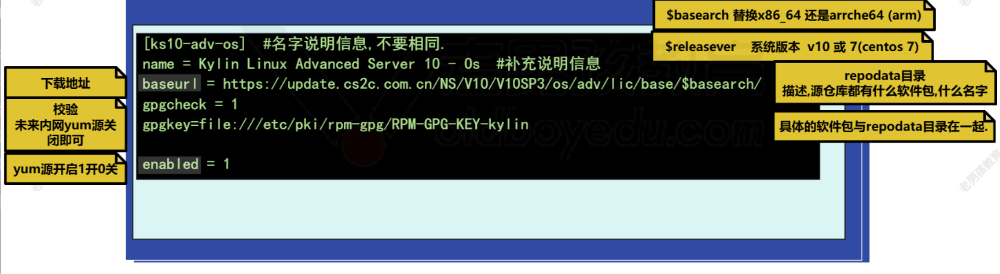
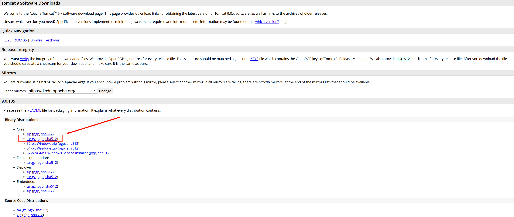

## 1、今日工作

- 编译安装


## 2、软件包管理-实战

### 2.1、yum/apt源配置

- 源===下载软件的仓库地址
- 配置多种源
  - 系统也有默认的源，里面也包括很多常用的软件
  - 安装nginx，配置nginx的yum源
  - 安装zabbix，配置zabbix的yum源

#### 2.1.1、红帽配置yum源

yum源配置文件存放地址：`/etc/yum.repos.d/`目录下，文件以`.repo`结尾

>`epel.repo`  额外配置增加的软件包
>`kylin_x86_64.repo`	麒麟自带的软件包

```sh
[ks10-adv-os]
name = Kylin Linux Advanced Server 10 - Os 	#源名字
baseurl = https://update.cs2c.com.cn/NS/V10/V10SP3/os/adv/lic/base/$basearch/		# 源地址
gpgcheck = 1	#校验未来内网yum源关闭即可
gpgkey=file:///etc/pki/rpm-gpg/RPM-GPG-KEY-kylin
enabled = 1		# 启动状态 1为开启 0为关闭
```



2.2.2、ubt/debian的apt源配置

**存放地址在`/etc/apt/sources.list`文件下或`/etc/apt/sources.lis.d`目录下**

```sh
cat sources.list
# Ubuntu sources have moved to /etc/apt/sources.list.d/ubuntu.sources

deb https://mirrors.aliyun.com/ubuntu/ noble main restricted universe multiverse
deb-src https://mirrors.aliyun.com/ubuntu/ noble main restricted universe multiverse

deb https://mirrors.aliyun.com/ubuntu/ noble-security main restricted universe multiverse
deb-src https://mirrors.aliyun.com/ubuntu/ noble-security main restricted universe multiverse

deb https://mirrors.aliyun.com/ubuntu/ noble-updates main restricted universe multiverse
deb-src https://mirrors.aliyun.com/ubuntu/ noble-updates main restricted universe multiverse

# deb https://mirrors.aliyun.com/ubuntu/ noble-proposed main restricted universe multiverse
# deb-src https://mirrors.aliyun.com/ubuntu/ noble-proposed main restricted universe multiverse

deb https://mirrors.aliyun.com/ubuntu/ noble-backports main restricted universe multiverse
deb-src https://mirrors.aliyun.com/ubuntu/ noble-backports main restricted universe multiverse
```

#### 2.2.3、红帽系统没有网络环境如何安装软件

##### 2.3.3.1、适用于临时操作（服务器不多）

1️⃣找个有网络的linux，同版本

2️⃣开启yum下载软件包保留功能（开启，指定目录）

3️⃣安装需要工具。服务并保留软件包

4️⃣软件包传输到对于的机器，yum localinstall安装


##### 2.3.3.1、适用于服务器百台起步

1️⃣找个有网络的linux，同版本

2️⃣开启yum下载软件包保留功能（开启，指定目录）

3️⃣安装需要工具。服务并保留软件包

4️⃣软件包传输到对于的机器，yum localinstall安装

5️⃣其他所有机器连接内网yum，直接yum install安装


- 2️⃣开启yum下载软件包保留功能（开启，指定目录）

```sh
# 1.编辑配置文件
vim /etc/yum.conf #yum命令的配置文件，yum安装软件包是否保留，yum安装软件时下载到那个目录
[main]
gpgcheck=1
installonly_limit=3
clean_requirements_on_remove=True
best=True
skip_if_unavailable=False
#增加两行
keepcache=1	#开启保留
cachedir=/var/cache/yum/	#指定安目录

# 2.重新安装软件包
yum reinstall -y tree telnet vim lrzsz nmap wget


# 3.查找已经下载的rpm包
find /var/cache/yum/ -type f -name '*.rpm'
```


### 2.4、二进制包安装

安装部署tomcat流程

| 部署流程                | 说明                                             |      |
| ----------------------- | ------------------------------------------------ | ---- |
| 1️⃣检查防火墙             | 关闭防火墙                                       |      |
| 2️⃣安装依赖               | java（jdk openjdk）                              |      |
| 3️⃣下载二进制包（压缩包） | 准备安装目录，解压到目录，创建软连接，修改所有者 |
| 4️⃣启动与检查             | 启动tomcat，检查端口/进程                        |      |
| 5️⃣浏览器访问             |                                                  |      |

#### 2.4.1、检查防火墙是否关闭

```sh
systemctl status firewalld.service
```

#### 2.4.2、安装依赖

下载安装java软件包

```sh
yum install -y java
```


#### 2.4.3、下载tomcat二进制包（压缩包）

##### 2.4.3.1、下载包

```sh
下载地址：https://tomcat.apache.org/download-90.cgi
wget https://dlcdn.apache.org/tomcat/tomcat-9/v9.0.105/bin/apache-tomcat-9.0.105.tar.gz
```

##### 2.4.3.2、md5校验软件包

```sh
# 官方sha512值
904f10378ee2c7c68529edfefcba50c77eb677aa4586cfac0603e44703b0278f71f683b0295774f3cdcb027229d146490ef2c8868d8c2b5a631cf3db61ff9956 *apache-tomcat-9.0.105.tar.gz
# 1.创建sha512值
sha512sum apache-tomcat-9.0.105.tar.gz
# 2.录入指纹
sha512sum apache-tomcat-9.0.105.tar.gz > apache-tomcat-9.0.105.tar.gz.sha512
# 3. 修改内容后检查
vim apache-tomcat-9.0.105.tar.gz.sha512	#删除所有内容后将官方的sha512值保存
# 检查
sha512sum --c apache-tomcat-9.0.105.tar.gz.sha512 
# 结果为ok表示没问题
apache-tomcat-9.0.105.tar.gz: OK
```



##### 2.4.3.2、解压包

```sh
# 1.创建/app/tools/目录
mkdir -p /app/tools/
# 2.将包解压到指定的目录
tar zxvf apache-tomcat-9.0.105.tar.gz -C /app/tools/

# 3.修改所有者为root.root
chown root.root /app/tools/apache-tomcat-9.0.105/
# 4.给/app/tools/apche-tomcat9.0.xxx创建软连接/app/tools/tomcat
ln -s /app/tools/apache-tomcat-9.0.105/ /app/tools/tomcat
```


#### 2.4.4、启动tomcat

```sh
# 启动
/app/tools/tomcat/bin/startup.sh
# 关闭
/app/tools/tomcat/bin/shutdown.sh

# 检查进程java进程
ps -ef

# 检查端口启用情况
ss -lntup |grep 8080
```


#### 2.4.5、访问

```sh
浏览器访问：http://10.0.0.200:8080

```


### 2.5、源码编译安装

编译安装nginx，一般情况下使用yum/apt安装即可，针对增加模块的情况才需要编译安装

| 部署流程    | 说明                                        |      |
| ----------- | ------------------------------------------- | ---- |
| 1️⃣检查防火墙 | 关闭防火墙                                  |      |
| 2️⃣安装依赖   | oepnssl-devel pcre-devel                    |      |
| 3️⃣下载编译包 |                                             |      |
| 4️⃣编译准备   | 1.添加用户（虚拟用户的nginx）2.解压到家目录 |      |
| 5️⃣编译       | ./configure 然后make 然后make install       |      |
| 6️⃣后续       |                                             |      |
| 7️⃣启动检查   |                                             |      |
| 8️⃣浏览器访问 |                                             |      |

#### 2.5.1、检查防火墙

```sh
systemctl status firewalld.service
```


#### 2.5.2、安装依赖

```sh
# 1.安装软件包openssl-devel pcre-devel  
yum install -y openssl-devel pcre-devel
# 2.安装完成检查软件包是否安装  
rpm -qa openssl-devel pcre-devel
```


#### 2.5.3、下载编译安装包

```sh
下载地址：https://nginx.org/en/download.html

wget https://nginx.org/download/nginx-1.28.0.tar.gz #下载到家目录
```

#### 2.5.4、编译准备

```sh
# 1.添加虚拟用户nginx，yum安装自动创建虚拟用户
useradd nginx -s /sbin/nologin -M nginx
# 2.解压到当前家目录，解压后删除压缩包节省磁盘空间
tar zxvf nginx-1.28.0.tar.gz

```


#### 2.5.5、编译

```sh
# 1.进入到解压后的目录
cd nginx-1.28.0/
# 2.编译前的配置，指定安装目录，指定用户，开启/关闭功能
# prefix指定目录
# --user 指定用户
# --group 指定用户组
./configure --prefix=/app/tools/nginx-1.28.0/ --user=nginx --group=nginx --with-http_ssl_module --with-http_v2_module --with-stream --with-http_stub_status_module

# 检查上一步代码命令是否执行成功来检测安装成功没用，0为成功，不是就是失败
# 每一步都检查一下为好
echo $? 

# 3.编译 源代码-->可执行文件（命令）
make -j 6 或 make -j`nproc` #可以先用lscpu检查cpu有几个核心 然后再指定数字


# 4.安装，过程：1.创建目录。2.复制移动文件
make install

# 5.检查编译安装的目录，进入到目录查看
tree /app/tools/nginx-1.28.0/
```


#### 2.5.6、后续添加软连接

```sh
# 给/app/tools/nginx-1.28.0/ 创建软连接 /app/tools/nginx
ln -s /app/tools/nginx-1.28.0/ /app/tools/nginx
```


#### 2.5.7、启动检查

```sh
# 1.检查 
/app/tools/nginx/sbin/nginx -t

# 2.检查端口和进程
ss -lntup|grep -w 80
ps -ef|grep -w 80

# 3.启动 
/app/tools/nginx/sbin/nginx

# 4.再次检查端口和进程是否已经被nginx使用
ss -lntup|grep -w 80
ps -ef

```


#### 2.5.8、浏览器访问

```sh
# 浏览器输入
http://10.0.0.200:80
```

## 3、今日总结

- yum/apt源配置、理解
- 没用网络环境安装软件包的流程
- 案例：二进制安装tomcat，编译安装nginx
