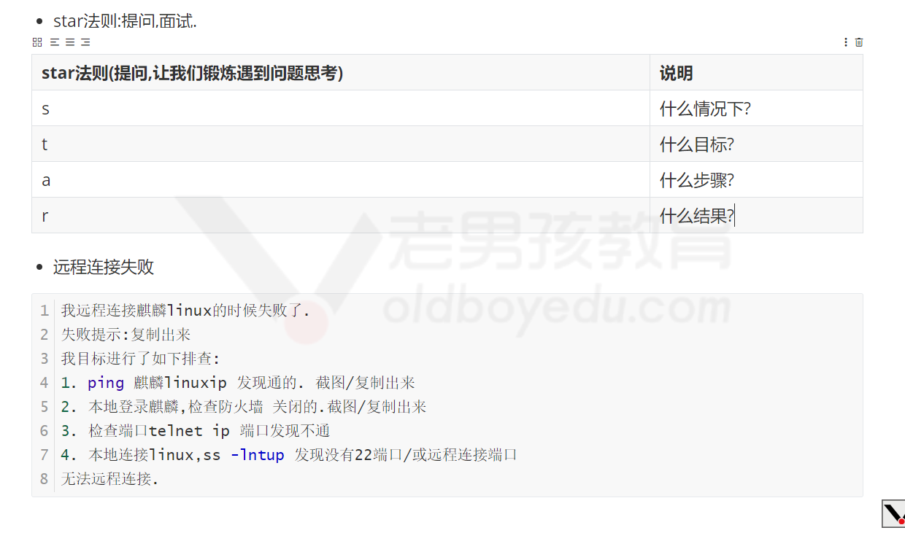
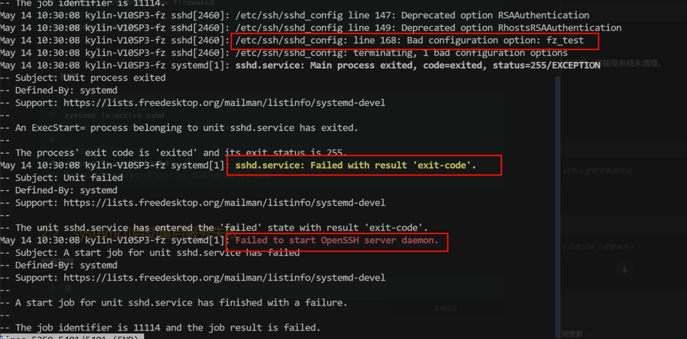
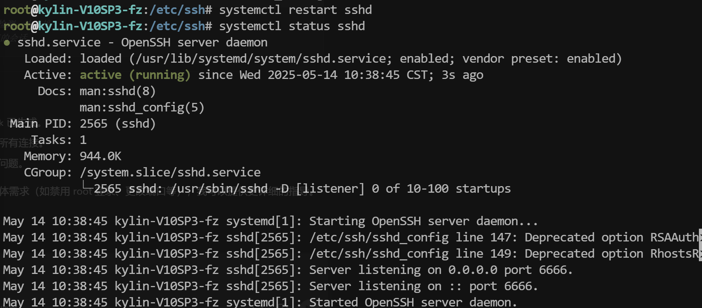
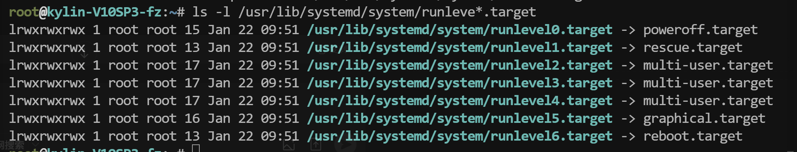
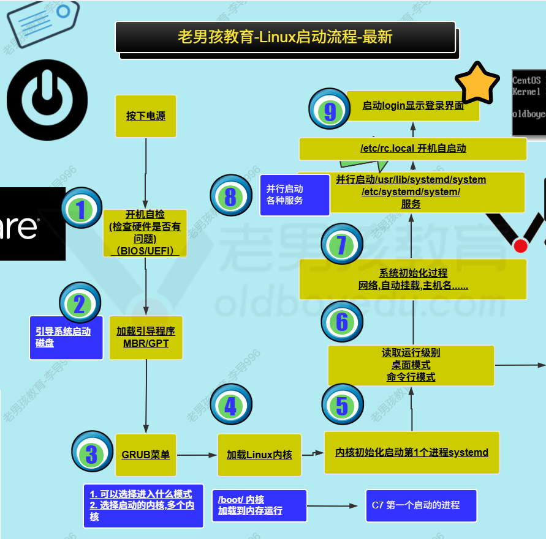

## 1、今日工作

- 使用光盘
- 服务管理


### 1.1、使用光盘

**挂载本地镜像CD到服务器**

```sh
df -h
df -h /mnt                                                     mount /dev/cdrom /mnt
df -h /mnt                                                       
cd /mnt/Packages/                                              
```

### 1.3、提问法则



## 2、服务管理


### 2.1、各种ctl

#### 2.1.1、systemctl

**systemctl管理的服务，默认需要通过yum/apt/rpm/deb方式安装，而进行和编译安装默认无法通过systemctl管理，需要我们后面书写systemctl配置文件才可以**

- **管理服务**

```sh
#1.启动
systemc start sshd
#2.开机自启动
systemc enable sshd
#3.检查
systemc status sshd
#4.重启
systemctl restart sshd
```


- **开关简写**

```sh
#1.停止与禁用开机自启动
systemctl disable --now firewakkd
#2.启动与启用开机自启动
systemctl enable --now sshd
```


- **检查**

```sh
#1.检查是否在运行
systemc is-active sshd
#运行的话返回结果为active，否则为inactive或其他

#2.检查是否开机自启动
systemc is-enabled sshd
#返回结果为enabled为正常自启动，否则为disabled或其他
```


### 2.2、systemctl服务启动或重启失败案例

- **制造故障**

```sh
# 将/etc/ssh/sshd_config把备份后修改文件再重启
cp /etc/ssh/sshd_config{,.bak}
```

- **故障提示**

```sh
systemctl restart sshd
Job for sshd.service failed because the control process exited with error code.
See "systemctl status sshd.service" and "journalctl -xe" for details.

#服务重启失败：
#使用systemctl status shhd或journalctl -xe查看详细错误提示

```

- **解决**

```sh
#检查步骤
#1.查看服务状态为失败未启动
systemctl status sshd
#2.通过查看更多信息查找错误信息
journalctl -xe #查看更多详细信息
journalctl -xe -u sshd #指定服务

#3.查看日志，查看指定日志，如果没日志
/var/log/messages	#红帽系统
/var/log/syslog		#ubt/debian系统

#4.查看得知是因为168行的配置错误是坏的

#5.进入到配置文件修改成功或删除后重启解决
#进入配置文件，删除168一行
vim /etc/ssh/sshd_config
#重启检查
systemctl restart sshd
systemctl status sshd
```



- **修改后重启解决**



### 2.3、其他ctl

- **hostnamectl**
- **timedatectl**
- **localectl查看和修改语言字符接**

#### 2.3.1、localectl语言字符集

- **查看**

```sh
localectl 
LANG=en_US.UTF-8 #英文
LANG=zh_CN.UTF-8 #中文

```

- **修改**

```sh
#1.彻底修改
localectl set-locale LANG=en_US.UTF-8

#2.查看是否修改，重新连接后生效
cat /etc/locale.conf

#2.临时修改（脚本中使用较多）
export LANG=en_US.UTF-8	#LANG环境变量

```

- **脚本配置临时生效**

```sh
#1.创建sh文件
vim test.sh

#2.写入脚本代码
export LANG=en_US.UTF-8
echo 统计CPU信息：
lscpu |grep 'Socket(s):'|awk '{print $2}'
echo 架构信息：
lscpu |grep 'rchitecture:'|awk '{print $2}'

#3.运行脚本
bash test.sh 
#返回结果如下：
统计CPU信息：
1
架构信息：
x86_64
```


## 3、面试题

### 3.1、Linux运行级别

- linux系统不同的状态：桌面模式，命令行模式

```sh
# 查看运行级别
ls -l /usr/lib/systemd/system/runleve*.target
```

| 运行级别 | 关机模式                                                     |
| -------- | ------------------------------------------------------------ |
| 0        | poweroff 关机模式                                            |
| 1        | rescue 救援模式（单用户模式），系统无法启动后会进到救援模式进行调试 |
| 2        | multi-user.target 多用户级别，名录库行模式，文本模式         |
| 3        | multi-user.target 多用户级别，名录库行模式，文本模式         |
| 4        | multi-user.target 多用户级别，名录库行模式，文本模式         |
| 5        | graphical 桌面模式、图形化、X11                              |
| 6        | reboot重启                                                   |



- 修改运行级别

```sh
#查看级别
systemctl get-default 
multi-user.target

#修改为图形化模式
systemctl set-defult graphical.target
```


### 3.2、Linux的启动流程




