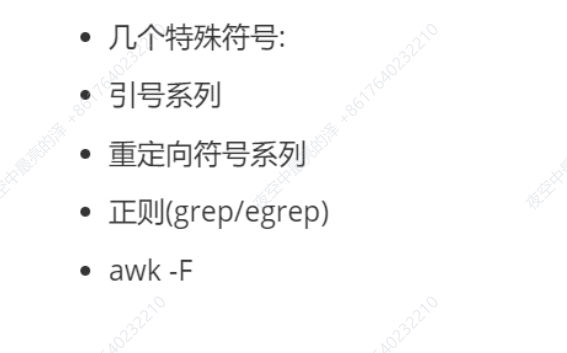
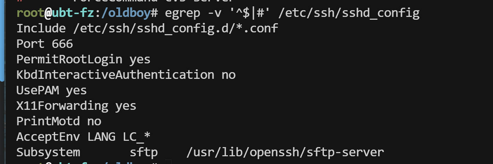
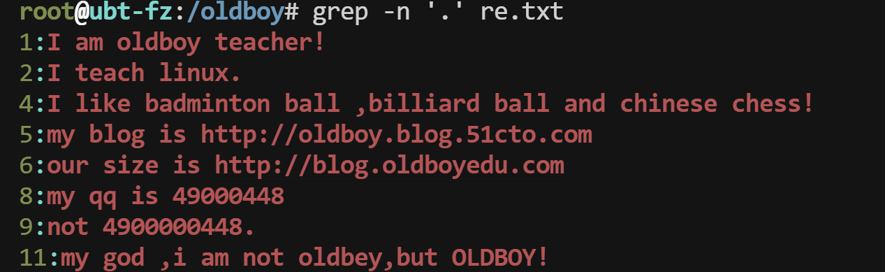
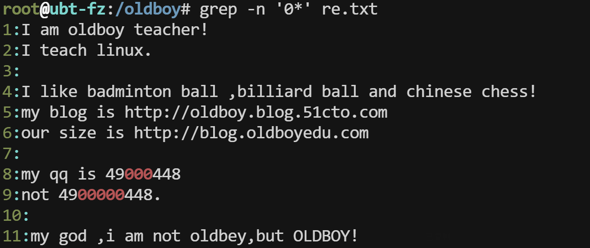
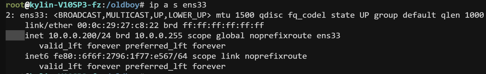
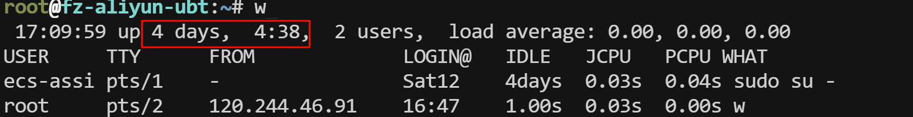
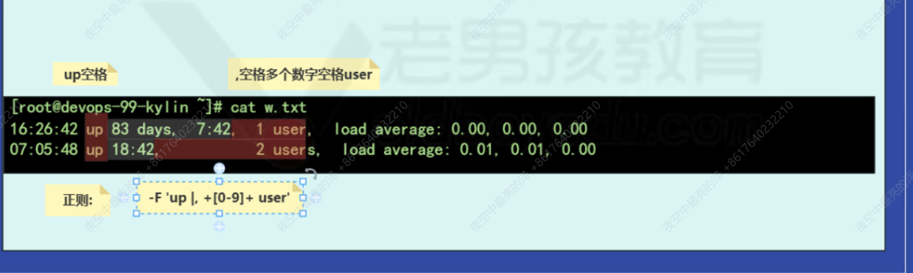

## 1、今日工作内容




## 2、特殊符号

### 2.1、引号系列

面试题：单引号、双引号、不加引号、反引号

| 引号           | 说明                                                         |
| -------------- | ------------------------------------------------------------ |
| **`反引号`**   | **优先执行，加上`` 、$() 两种写法**                          |
| **`单引号`**   | **''所见即所得。单引号里面的内容直接输出不会被处理，命令解释器没有解析** |
| **`双引号`**   | **"" 类似于单引号，但有一些特殊符号会被解析运行，``，$，$()，...** |
| **`不加引号`** | **不加引号类似于双引号，额外支持{}、*通配符**                |

```sh
#双引号结合其他符号
echo "oldboy `whoami` $(pwd) lidao{01..5} *"
oldboy root /root lidao{01..5} *

#单引号集合其他符号
echo 'oldboy `whoami` $(pwd) lidao{01..5} *'
oldboy `whoami` $(pwd) lidao{01..5} *

#不加引号
echo oldboy `whoami` $(pwd) lidao{01..5} *
oldboy root /root lidao01 lidao02 lidao03 lidao04 lidao05 1.txt anaconda-ks.cfg apache-tomcat-9.0.105.tar.gz apache-tomcat-9.0.105.tar.gz.sha512 EOF etc-2025-05-13-2-etc.tar.gz initial-setup-ks.cfg one two
```

### 2.2、重定向符号

- `>`重定向，`>>`追加重定向

| 重定向符号                                                 | 说明                                             | 使用                               |
| ---------------------------------------------------------- | ------------------------------------------------ | ---------------------------------- |
| **`>或1>`**                                                | **重定向符号（标准输出重定向），先清空在写入**   | **创建文件并写入内容**             |
| **`>>或1>>`**                                              | **追加重定向（标准输出追加重定向），追加到末尾** | **修改配置**                       |
| **`2>`**                                                   | **标准错误输出重定向，先清空然后写入错误信息**   | **较少单独使用**                   |
| **`2>>`**                                                  | **标准错误输出追加重定向，追加到末尾**           | **较少单独使用**                   |
| **`>>test.log 2>&1`<br />`&>>test.log（有些系统不支持）`** | **错误信息和正确信息都写入到一个文件中**         | **经常使用（运行脚本或定时任务）** |
| `<或0<`                                                    | 与特定命令使用，读取文件内容tr，xargs            | 其他命令不会用                     |
| `<<或0<<`                                                  | cat命令向文件中批量写入多行内容                  | 常用                               |

### 2.3、**`cat`批量向文件写入多行**

```sh
#先在某个地方写好内容，然后复制到linux服务器
cat >>test.txt <<EOF
test
echo
openssh
start
EOF

cat >或>> 文件名字	<< 结束标记
内容
结束标记


cat <<EOF >>test.txt 
奥利给
echo
openssh
start
EOF
```

- **tr 字母级别/字符级别的替换（将文件内容的大写转换成小写）**

```sh
#将小写字母全部替换为大写
tr 'a-z' 'A-Z' < passwd  #输出
```

- xargs 参数转换，控制参数的个数（列）

```sh
seq 10 > num.txt
xargs -n3 <num.txt
```


## 3、正则表达式

### 3.1、简介

- 一般是四剑客使用，开发语言也支持
- 对字符进行过滤，更精确

### 3.2、注意事项

- 符号为英文符号
- 配置grep、egrep --color颜色别名

### 3.3、正则符号

| 正则符号 | 符号                         | 命令           |
| -------- | ---------------------------- | -------------- |
| 基础正则 | ^、$、^$、.、* 、.*、[]、[^] | grep/sed/awk   |
| 扩展正则 | \| + {} () ?                 | egrp/sed-r/awk |

### 3.4、grep基础正则

#### 3.4.1、准备测试文件

```sh
cat >/oldboy/re.txt<<EOF
I am oldboy teacher!
I teach linux.

I like badminton ball ,billiard ball and chinese chess!
my blog is http://oldboy.blog.51cto.com  
our size is http://blog.oldboyedu.com  

my qq is 49000448
not 4900000448.

my god ,i am not oldbey,but OLDBOY!
EOF
```


#### 3.4.2、`^`以什么开头的行

```sh
grep '^m' re.txt 
#输出结果如下：
my blog is http://oldboy.blog.51cto.com  
my qq is 49000448
my god ,i am not oldbey,but OLDBOY!
```


#### 3.4.3、`$`以什么结尾的行

```sh
grep '!$' re.txt 
#输出结果如下：
I am oldboy teacher!
I like badminton ball ,billiard ball and chinese chess!
my god ,i am not oldbey,but OLDBOY!

grep 'm  $' re.txt 
#输出结果如下：
my blog is http://oldboy.blog.51cto.com  
our size is http://blog.oldboyedu.com  
```

- **cat -A查看隐藏的符号**

#### 3.4.4、`^$`空行

- 排除空行或者包含#井号的行（井号开头的行）

```sh
grep -v '^$' re.txt
```

- 排除/etc/ssh/sshd_config空行或井号的行

```sh
egrep -v '^$|#' /etc/ssh/sshd_config	#-v取反。取出没有空格和井号的行
```




#### 3.4.5、`.`任意一个字符

- **过滤内容，不匹配空行**，经常`.*`搭配使用

```sh
grep -n '.' re.txt
```




#### 3.4.6、`*`前一个字符出现0或0次以上

- 重复/连续出现

```sh
grep -n '0*' re.txt
```

- **因为*的坑，出现0次也会输出，所以输出了文件所有内容**




#### 3.4.7、`.*`表示所有

```sh
grep '^.*0' re.txt
#输出结果如下：
my qq is 49000448
not 4900000448.


#正则表达式匹配所有或连续出现的时候：贪婪性
grep '^.*oldboy' re.txt
#输出结果如下：
I am oldboy teacher!
my blog is http://oldboy.blog.51cto.com  
our size is http://blog.oldboyedu.com  


#过滤以I开头！结尾的行
grep '^I.*!$' re.txt 
#输出结果如下：
I am oldboy teacher!
I like badminton ball ,billiard ball and chinese chess!
```

#### 3.4.8、`[]`匹配或

- **基本用法与格式**

```sh
#过滤a、d、g
grep '[a,d,g]' re.txt 

#-O显示匹配过程
grep -o -n '[a,b,c]' re.txt

#过滤数字
grep '[0-9]' re.txt

#过滤小写字母
grep '[a-z]' re.txt

#过滤大写字母
grep '[A-Z]' re.txt

#过滤大小写字母
grep'[a-zA-Z]' re.txt

#过滤大小写字母和数字
grep '[a-zA-Z0-9]' re.txt
grep '[a-Z0-9]' re.txt	#不通用
grep '[0-Z]' re.txt	#不通用
```

- **过滤出以I或m或n开头的行**

```sh
grep '^[Imn]' re.txt 
```

- **过滤出以I或m或n开头、!或数字结尾的行**

```sh
grep '^[Imn].*[!0-z]$' re.txt 
#输出结果如下：
I am oldboy teacher!
I like badminton ball ,billiard ball and chinese chess!
my qq is 49000448
my god ,i am not oldbey,but OLDBOY!
```


#### 3.4.9、`[^]、[^a-z]` 不匹配

```sh
grep '[^abc]' re.txt 
```


#### 3.4.10、转义符`\`

**改变后续字符的原始含义，使其具有特殊功能或恢复字面意义**

```sh
grep '\.$' re.txt 
I teach linux.
not 4900000448.
```


### 3.5、grep扩展正则

#### 3.5.1、`|`或者

```sh
ps -ef |egrep 'sshd|syslog'
#第2种写法
ps -ef |grep -E'sshd|syslog'
#第3种写法
ps -ef |grep 'sshd\|syslog'
```


#### 3.5.2、`+`前一个字符出现1次或1次以上

- **重复/连续出现**
- **常用与`[]`搭配使用**

```sh
egrep '0+' re.txt

egrep -o '[a-z]+' re.txt

```


#### 3.5.3、`{}`前一个字符出现指定范围次数

- `o{n,m}`前面字符o出现n次或m次

```sh
#标配是范围的匹配，出现1位~3位数字
egrep '[0-9]{1,3}' re.txt
#身份证号18位数字
egrep '[0-9]{3}' re.txt
```

- 简易的正则匹配IP地址

```sh
([0-9]{1,3}\.){3}[0-9]{1,3}
```


#### 3.5.4、`()`一个整体


```sh
#重复的内容
lscpu |egrep 'L(1d|1i|2|3) cache'

#更加精简的写法
lscpu |egrep -i 'L(1[d,i]|[2,3]) cache'
lscpu |egrep -i 'L(1[di]|[23]) cache'
```


#### 3.5.5、`？`前一个字符出现1或0次

```sh
#创建测试文件
cat >test.txt<<EOF
good
goooood
gd
god
gooood
EOF


egrep 'go?d' test.txt 
#输出结果如下：
gd
god


egrep 'go+d' test.txt 
#输出结果如下：
good
goooood
god
gooood

egrep 'go*d' test.txt 
#输出结果如下：
good
goooood
gd
god
gooood
```


## 4、awk+正则

>- **awk取列取行**
>- **取列：正序、倒序、结合正则取**
>- **取行：行号、正则取**

### 4.1、awk取列与正则

#### 4.1.1、`awk -F` 指定或修改分隔符

- **取出/etc/passwd第1列,第3列,最好一列，倒数第一列**

```sh
#取出/etc/passwd第1列,第3列,最好一列，倒数第一列
awk -F':' '{print $1,$3,$NF,$(NF-1)}' /etc/passwd
```

#### 4.1.2、案例

- **在网卡信息中取出IP地址**



```sh
#取出指定网卡的信息
ip a s ens33
ip addr show ens33


#取出第三行
ip a s ens33|awk 'NR==3'


#指定以空格和/分割，并且连续出现切割一次（inet前面有四个空格）
#正则匹配空格或/
ip a s ens33|awk 'NR==3'|awk -F'[ /]+' '{print $3}'
10.0.0.200
```

- **`w`命令结果中获取运行时间**



```sh
w|awk 'NR==1'|awk -F'up +|, +[0-9]+ user' '{print $2}'
4 days,  4:39
```



### 4.2、awk取行

- awk 'NR==3'指定行号
- awk 'NR>=3'取3行及以上的行号
- awk 'NR>=3 && NR<=10'取3行到10行

- awk取行与正则搭配，类似于grep/egrep

```sh
#1.在/etc/passwd中过滤包含root的行或oldboy的行
egrep 'root|oldboy' /etc/passwd

awk '/rootloldboy/' /etc/passwd
awk '/^root/' /etc/passwd
awk '/bash$/' /etc/passwd
```

