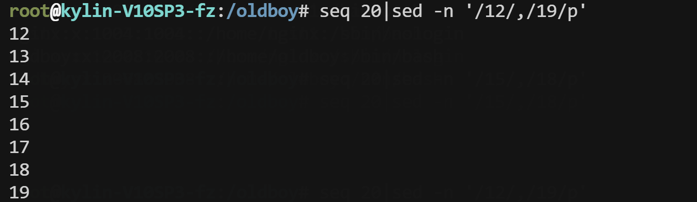
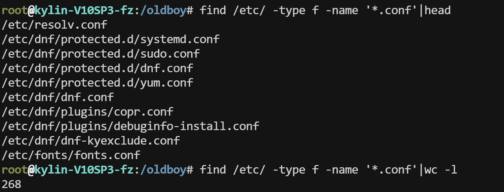

## 1、今日工作内容

- sed
- find

| 四剑客           | 共同点   | 区别与使用             |
| ---------------- | -------- | ---------------------- |
| **`find`**       | **无**   | **查找文件、目录....** |
| **`grep/egrep`** | **过滤** | **仅仅过滤与查看**     |
| **`sed`**        | **过滤** | **替换、删除**         |
| **`awk`**        | **过滤** | **取列、计算**         |

## 2、sed

- 增删改查
- 核心：查找、修改、替换

| **sed命令选项** | **说明**                                                     |      |
| --------------- | ------------------------------------------------------------ | ---- |
| **`-n`**        | **取消默认输出，不加会输出文件全部内容**                     |      |
| **`-r`**        | **支持扩展正则**                                             |      |
| **`-i`**        | **直接修改文件内容<br />`i.bak`备份文件为后缀.bak后再修改文件内容<br />不要与-n同时使用，会清空文件内容** |      |
| `-d`            | **删除**                                                     |      |


| **选项**            | **处理指令**                                                 | **参数** |
| ------------------- | ------------------------------------------------------------ | -------- |
| **`-n`**            | **`p`（print 打印输出）**                                    | **文件** |
| **`**p查找功能**`** | **1p（第1行）<br />1,3p（1~3行）<br />//p（例如/11:02:00/）<br />//,//p（斜杠内写过滤的内容，例如/11:02:00/,/11:30:00/）** | **取行** |
| **`**s###g**`**     | **s#源内容#替换的内容#g<br />###可以替换为任意符号，例如s@@@g或s///g** | **替换** |


### **2.1、查找**

**类似于grep、egrep、awk'//'功能，本质上就是取行**

#### **2.1.1、根据行号取内容**

```sh
#取出第一行
sed -n '1p' passwd
```

#### **2.1.2、根据行号范围取行**

```sh
#范围取行，取出5-9行
sed -n '5,9p' passwd 
```

#### **2.1.3、过滤与正则**

```sh
#过滤passwd文件中包含root和test的行
sed -rn '/root|test/p' passwd
```

#### **2.1.4、范围与日志**

- **目标：获取一个范围的内容，比如2025-01-11日到2025-05-01范围的日志**

##### **2.1.4.1、简易版本**

```sh
使用命令seq 20生成20行内容,过滤从包含2的行显示到包含9的行
seq 20 | sed -n '/2/,/9/p'
seq 20 | sed -n '/12/,/19/p'
```

****

##### **2.1.4.2、指定时间范围过滤日志**

```sh
# 1. access.log过滤 11:05到11:06分的日志
#先检查是否存在
grep '11:05' access.log |head
grep '11:06' access.log |head

#随后根据时间范围过滤
 sed -n '/11:04:00/,/11:06:00/p' access.log |wc -l
 
 
 
 
# 2. secure日志过滤
#12号12时12分00秒～13号15时15分00秒
grep '12 12:12:00' secure-20161219
grep '13 15:15:00' secure-20161219
 
#根据时间范围过滤
sed -n '/12 12:12:00/,/13 15:15:00/p' secure-20161219 |wc -l
#过滤数量如下：
52234

#不加日期，过滤数量增多
sed -n '/12:12:00/,/15:15:00/p' secure-20161219 |wc -l
#过滤数量如下：
224305
```

- **取出access.log日志中从开头一直到11:30范围日志,取出第1列,统计次数最多的前5**

```sh
sed -n '/11:02:00/,/11:30:00/p' access.log |awk '{print $1}'|sort -rnk1|uniq -c |sort -rnk1|head -5


sed -n '1,/11:30:00/p' access.log |awk '{print $1}'|sort -rnk1|uniq -c |sort -rnk1|head -5
```


### **2.2、修改与替换**

> **可以修改或替换文件内容**

#### **2.2.1、基础替换文件内容**

```sh
#1.替换查看，并不会直接修改文件内容
sed 's#/sbin/nologin#/bin/bash#g' passwd

#2.-i选项，直接修改文件内容，有些危险，再三确认后才可运行
sed -i 's#/sbin/nologin#/bin/bash#g' passwd
```

#### **2.2.2、正则替换修改**

**2.2.2.1、给passwd文件每一行的开头加上`#`注释符号**

```sh
sed 's@^@#@g' passwd

#直接修改
sed -i 's@^@#@g' passwd
```

#### **2.2.3、修改前备份**

```sh
sed '1,10s@^#@@g' passwd 

#修改备份
sed -i.bak '1,10s@^#@@g' passwd 
```


#### **2.2.4、隐藏功能：反向引用（后向引用）**

> **通过正则把需要处理的内容进行分组，然后在后面通过\数字的方式进行调用分组**
>
> **对行进行复杂加工处理或调换**

- **修改格式**

```sh
echo 123456|sed -r 's#(.*)#<\1>#'
#输出结果如下：
<123456>
```

- **调换位置**

```sh
echo 123456|sed -r 's#(..)(..)(..)#\3\2\1#'
#输出结果如下：
563412

#可以加上任意符号分割
echo 123456|sed -r 's#(..)(..)(..)#\3.\2.\1#'
#输出结果如下：
56.34.12
#输出结果如下：
echo 123456|sed -r 's#(..)(..)(..)#\3-\2-\1#'
56-34-12
```

- **调换passwd第一列和最后一列的内容，中间保持不变**

```sh
#原始：
root:x:0:0:root:/root:/bin/bash

#目标：
/bin/bash:x:0:0:root:/root:root

sed -r 's#(^.*)(:x.*:)(.*)#\3\2\1#g' passwd
```

### 2.3、删除

**以“行”为单位进行删除**

- 根据行号删除

```sh
sed '3d' re.txt 

sed -i.bak '3,4d' re.txt 
```

- 过滤与正则

```sh
sed -r '/^$|#/d' re.txt
```


### 2.4、增加

> 1. **`a` append 在指定行的下一行增加**
> 2. **`i` insert 在指定行的上一行增加**
> 3. **`c` replace 把指定行内容化替换**

```sh
seq 10 |sed '5a aoligei'
seq 10 |sed '5i aoligei'
seq 10 |sed '5c aoligei'
```


### 2.5、sed增删改查小结

排除/删除 /etc/ssh/sshd_config文件中空行或注释行(不用真的删除)egrep/sed/awk分别实现

```sh
awk '!/^$|^#/' /etc/ssh/sshd_config

sed -r '/^$|^#/d' /etc/ssh/sshd_config

egrep -v '^$|#' /etc/ssh/sshd_config
```


## 3、find


- 根据指定的目录找出想要的内容（文件或目录）
  - 根据文件名查找
  - 根据文件大小查找
  - 根据文件的时间查找（主要用于删除日志使用）
- find与其他命令可以搭配使用
  - find+tar
  - +rm
  - +cp

| find命令的选项            | 参数                                          | 作用                                                         |
| ------------------------- | --------------------------------------------- | ------------------------------------------------------------ |
| **`-type`**               | **`f/d`**                                     | **指定查找的类型，f（file）文件、d（driectory）目录**        |
| **`-name`<br />`-iname`** | **`'文件名'`**                                | **指定要查找的文件，用双引号或单引号括起来<br />加上`i`不区分文件名的大小写** |
| **`-size`**               | **`+10k/-10`**                                | **查找文件的大小，`+`是大于、`-`是小于**                     |
| **`-mtime`**              | **`+N`**                                      | **查找 修改时间（mtime） 超过 `N` 天的文件**                 |
| **`-ctime`**              | **`+N`**                                      | **查找 状态变更时间（ctime） 超过 `N` 天的文件（如权限、所有者变更）** |
| **`-atime`**              | **`+N`**                                      | **查找 访问时间（atime） 超过 `N` 天的文件**                 |
| `-exec`                   | ` find -exec egrep --color 'root|test' {} \;` |                                                              |


### 3.1、find查找


```sh
find 目录 -type f -name "test.txt"
#目录1个或多个目录，不写默认为当前目录
-type 类型 f file文件 	d directory 目录
-name 指定查找文件名内容
```


#### 3.1.1、找出/etc/下以.conf结尾的文件

```sh
find /etc -type f -name '*.conf' 
```



#### 3.1.3、找出/etc/下大于100k文件

```sh
ind /etc/ -type f -size +100
```


#### 3.1.3、找出/var/log下面以.log结尾并且是7天之前的文件

```sh
find /var/log/ -type f -name '*.log' -mtime +7
```


#### 3.1.4、查找文件不区分大写小写(文件名)

```sh
touch teST{1..10}.txt test{1..10}.txt TEst{1..10}.txt
find -type f -iname '*.txt' 
```


### 3.2、find与其他命令搭配使用

#### 3.2.1、find+grep/rm/sed

- **/etc/下找出以.conf结尾的文件,找这些文件中过滤包含root或test的行**

```sh
#1.方法1
find /etc/ -type f -name '*.conf'|xargs egrep --color 'root|test'

#2.方法2
egrep 'root|test' `find /etc/ -type f -name "*.conf"`

#3.方法3
find /etc/ -type f -name '*.conf' -exec egrep --color 'root|test' {} \;
```


#### 3.2.2、find+tar

- **查找出来的数据内容交给tar压缩**

```sh
#1.方法1
find /etc/ -type f -name '*.conf'|xargs tar zcvf /vackup/etc-conf.tar.gz
#2.方法2
tar zcvf /vackup/etc-conf.tar.gz `find /etc/ -type f -name "*.conf"`
#3.方法3
find /etc/ -type f -name '*.conf'  -exec tar zcvf /vackup/etc-conf.tar.gz {} +
```


#### 3.2.3、find+cp

- **find找出文件通过cp复制到指定目录**

> **`cp -t`先指定复制的目标位置 再指定源文件或目录**

```sh
#1.方法1
find /var/log/ -type f -name '*.log'|xargs cp -t /backup/logs

#2.方法2

cp -t /backup/logs `find /var/log/ -type f -name '*.log'`
cp `find /var/log/ -type f -name '*.log'` /backup/logs


#3.方法3
find /var/log/ -type f -name '*.log' -exec {} /backup/logs/ \;
```

- 找出各种文件
- find与命令配合sed、grep、rm
- 有些坑find+tar、find+cp/mv  
