## 1.Linux系统介绍

### 1.1 常用的linux系统版本(linux发行版本)

| **常用的linux** | 详情介绍                       |                                                              |
| --------------- | ------------------------------ | ------------------------------------------------------------ |
| `红帽阵营`      | RedHat Enterprise Linux (RHEL) | 红帽企业版Linux红帽属于IBM                                   |
|                 | Centos                         | 与红帽高度相似,开源的,centos被红帽收购后与24年6月停止更新<br />被收购后停止更新前centos stream系列没有之前那么稳定<br />之前:红帽系统-->centos 之后:centOS stream 稳定了-->红帽 |
|                 |                                |                                                              |
| `Debian阵营`    | Debian                         | 稳定,更新慢                                                  |
|                 | Ubuntu                         | 主要是桌面非常友好与windows类似,开发人员喜欢,也具有针对Ubuntu Server服务器版本 |
|                 |                                |                                                              |
| `国产阵营`      | 麒麟 Kylin                     | 现在国家提倡国产化信创                                       |
|                 | 统信 UOS linux                 |                                                              |
|                 | 国产云厂商                     | 华为(欧拉 oepnEuler),阿里(Anolis)...                         |

> 去IOE计划：现在国产化趋势猛烈,IBM的服务器,Oracle(甲骨文)的数据库,EMC(Dell收购)的存储

- 小结:
  - RHEL红帽企业版
  - Centos
  - Debian
  - Ubuntu
  - 麒麟(kylin)/华为欧拉(oepnEuler)/阿里龙蜥(Aonlis)

### 1.2 常用具体的linux与版本

| Linux系统类别     | 具体版本                 | 备注                                                         |
| ----------------- | ------------------------ | ------------------------------------------------------------ |
| `经典`            | Centos 7.9               | 24.6月份停止更新,目前市场大部分企业还在使用                  |
|                   |                          |                                                              |
| `企业常用的Linux` | 国产                     | 麒麟/欧拉/龙蜥 国外:Ubuntu,Rocky                             |
|                   | 麒麟V10 SP3              | 银河麒麟服务器操作系统V10 SP3是一款直接面向kernel根社区，基于openEuler社区构建的强安全、高可靠的国产Linux操作系统。这表明它使用了openEuler的代码库作为其开发的基础，并在此之上进行了定制和优化，以满足中国国家安全和监管需求，以及企业级用户的特定要求。<br />openEuler本身是一个开源的Linux发行版，由华为发起，旨在建立一个开放、多元和包容的软件生态。银河麒麟V10 SP3在openEuler的基础上，针对不同的国产CPU平台（如飞腾、龙芯、鲲鹏、申威、兆芯、海光等）进行了深入优化，同时也支持Intel和AMD的CPU架构，提供了对多种应用场景的支持，包括云计算、大数据、人工智能、高可用性集群等。 |
|                   | Ubuntu 18.04/22.04/24.04 | 长期支持版本(统称LTS版本),更新周期支持时间长<br />临时发布版本(Interim Release)在LTS版本之间，Canonical每六个月发布一次临时版本 |
|                   | Rocky 9.x                | 是一个**企业级开源 Linux 发行版**，旨在作为 **Red Hat Enterprise Linux (RHEL)** 的**100% 二进制兼容替代品**。它由 **CentOS 联合创始人 Gregory Kurtzer** 发起，以填补 CentOS 转向 **CentOS Stream** 后留下的空白。<br />Rocky Linux 9.x 是当前稳定版本（截至 2024 年），基于 **RHEL 9.x**，提供长期支持（LTS），适用于服务器、云计算和企业环境。 |

### 1.3 工作环境搭建

现有服务器-->虚拟机-->安装搭建应用服务

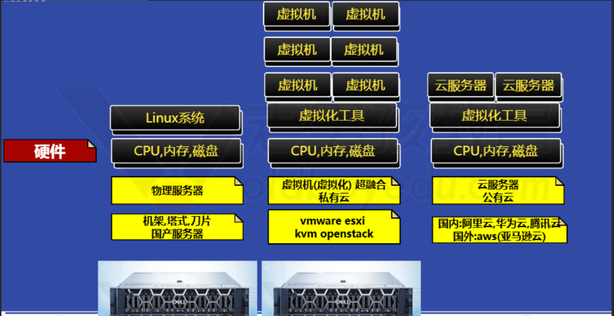

## 2.创建虚机安装linux系统

### 2.1 环境准备

笔记本电脑的配置如下:

| 环境准备       | 说明                    | 备注 |
| -------------- | ----------------------- | ---- |
| 电脑系统       | windows                 |      |
| CPU            | 随意                    |      |
| 内存(运行内存) | 16G以上                 |      |
| 硬盘           | 1T以上                  |      |
| 虚拟化软件     | vmware workstation 17.5 |      |

- 安装vmware软件

  - 配置vmware软件-虚拟机存放的位置(C盘除外那个分区都可以,例如D:/vmware)
    

  - 第一步打开vmware.exe-->选择`典型`-->下一步
    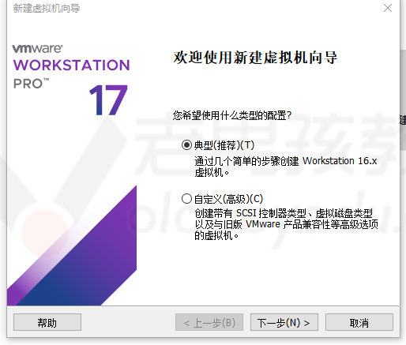

  - 选择`稍后安装操作系统`
    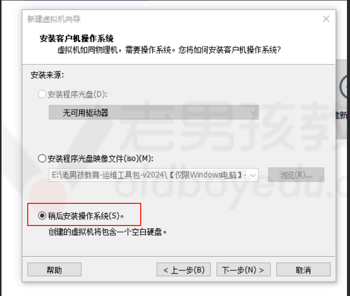

  - 选择`Liunx`-->版本选择`Centos 7 64位`--下一步
    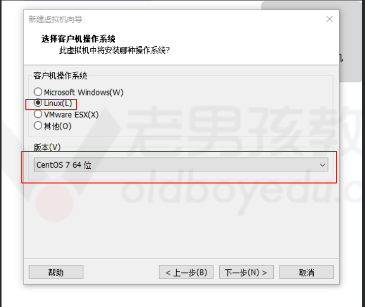

    - 根据操作系统选择对应的版本类型,`Ubuntu`就选择对应的`Ubuntu`
    - `debian`就选择`debian`,还有其他类型,到时可以到deepweek或者CSDN查询均能找到答案

  - 输入`虚拟机名称`-->选择虚拟机`存放位置`-->下一步
    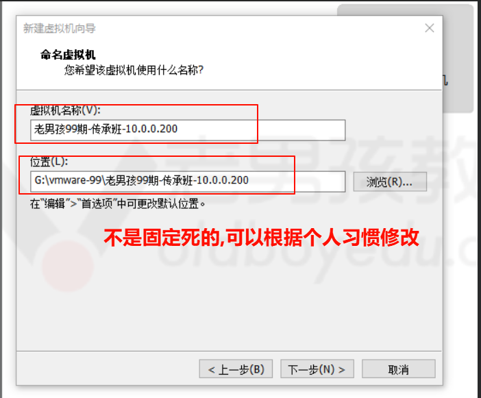

  - `指定磁盘大小`,一般建议80~100-->默认为`将虚拟磁盘拆分成多个文件`,所以不需要改动-->下一步
    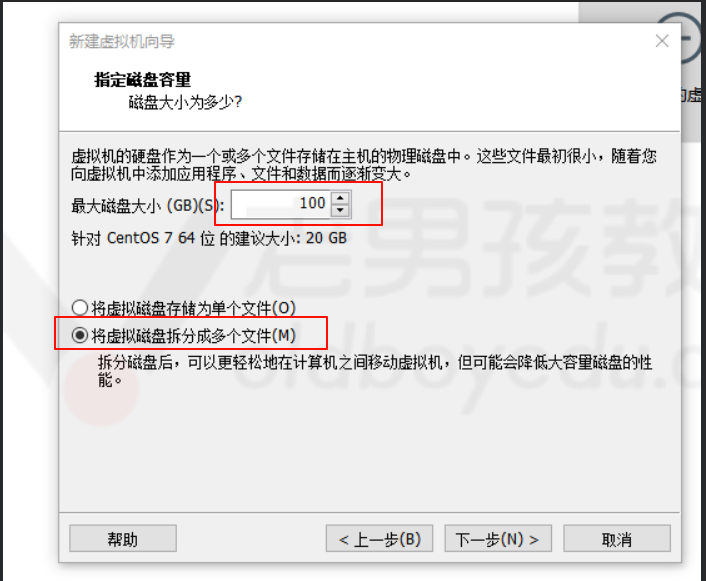

  - 点击`自定义硬件`-->使用`ISO映像文件`,找到你存放镜像文件的目录选择你要安装的镜像文件-->下一步
    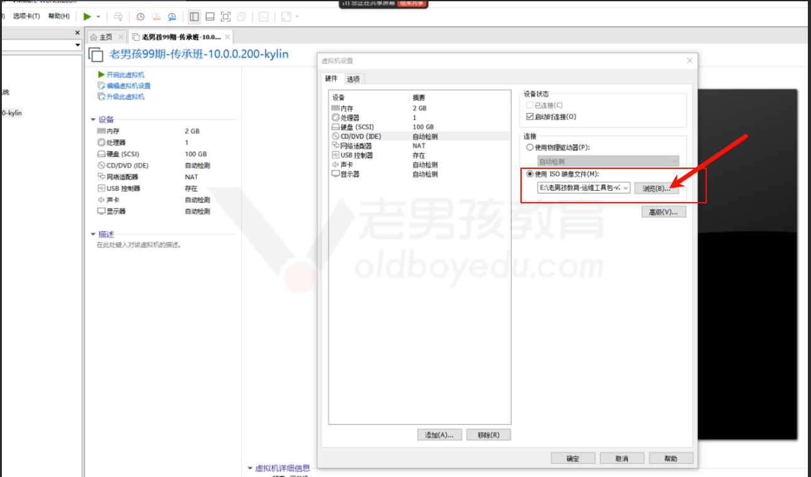

  - 查看虚拟机镜像文件地址是否正确后点击`开启此虚拟机`

    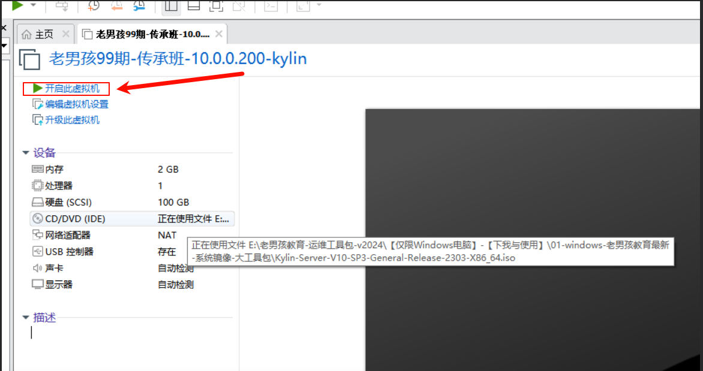
    
  - vmware窗口显示黑色界面-->双击黑色界面后键盘上下选择第一项-->点击回车
    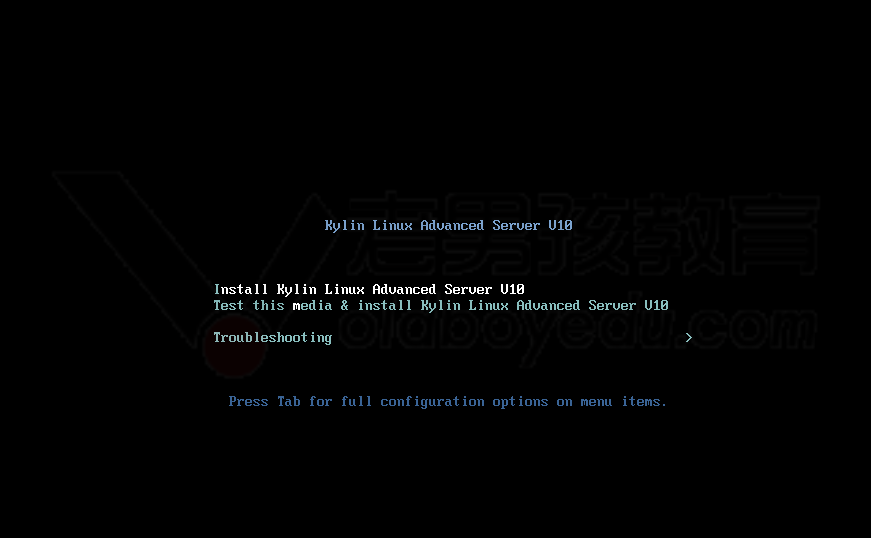
  
  - 选择中文-->点击继续
  
    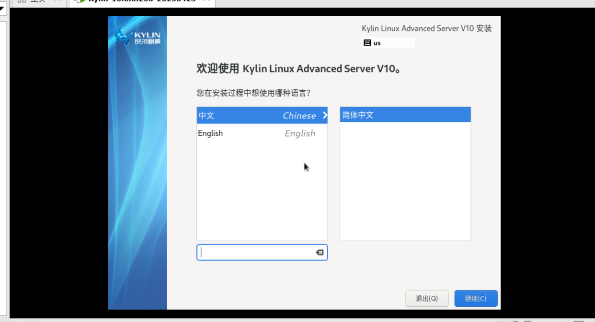
  
  - 选择最小安装:
  
    - `附加软件`选择标准/调试工具/开发工具/系统工具/Man手册-->点击完成
      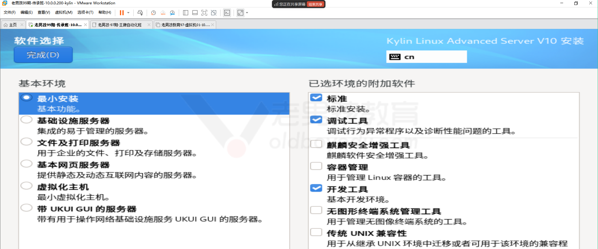
      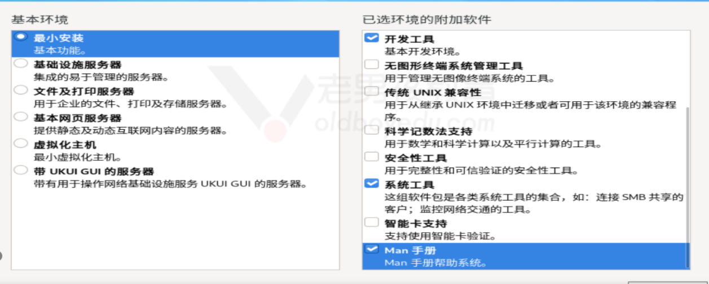
  
  - 配置网络
  
    - `点击网络和主机名`--点击`配置`
      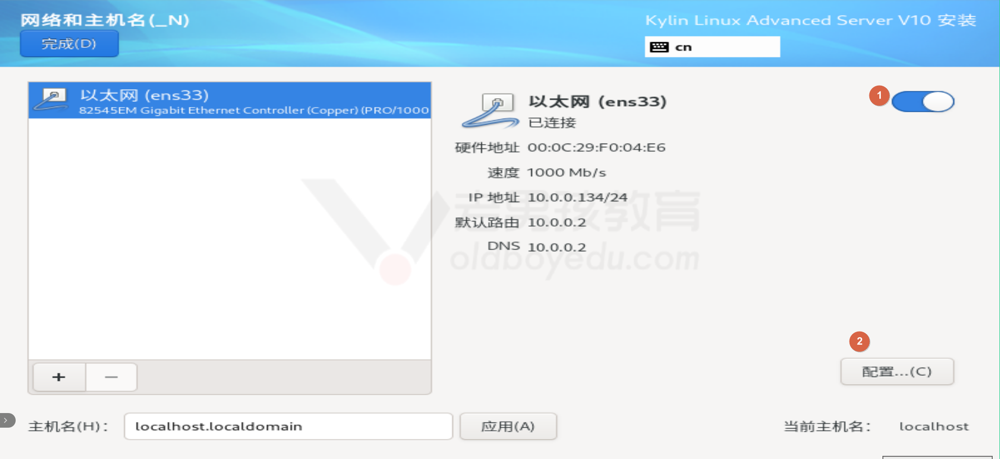
  
    - 点击`常规`-->勾选`自动连接`
      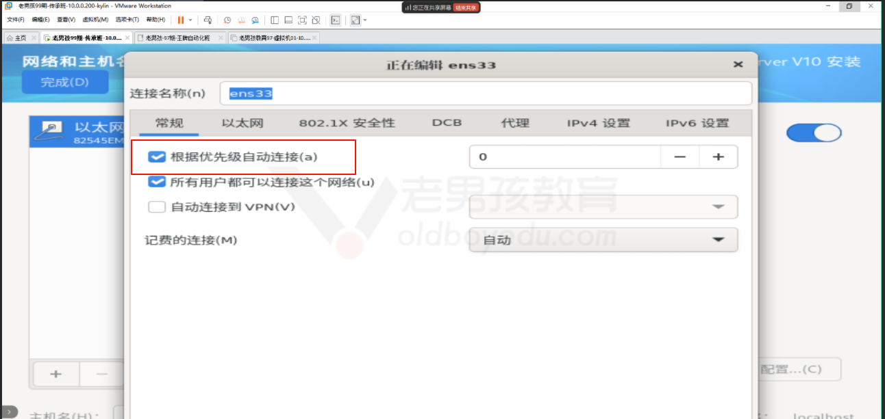
  
    - 点击`IPV4`-->`手动`		
      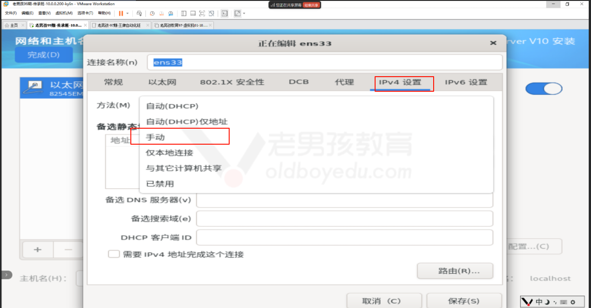
  
    - 点击添加-->输入`IP地址/子网掩码/网关`-->点击完成
      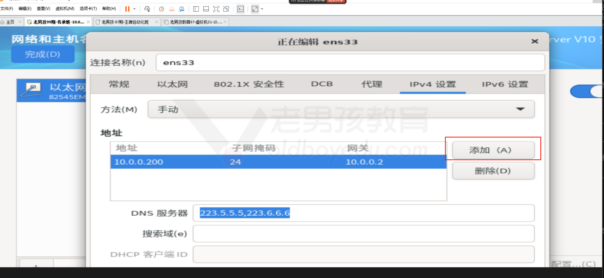
  
  - 另外日期时间检查和当前电脑时间一致即可
    磁盘分区点进去是默认的不要动,点击完成返回就分区完成了
    root密码设置一下点击完成
  - 等待安装
    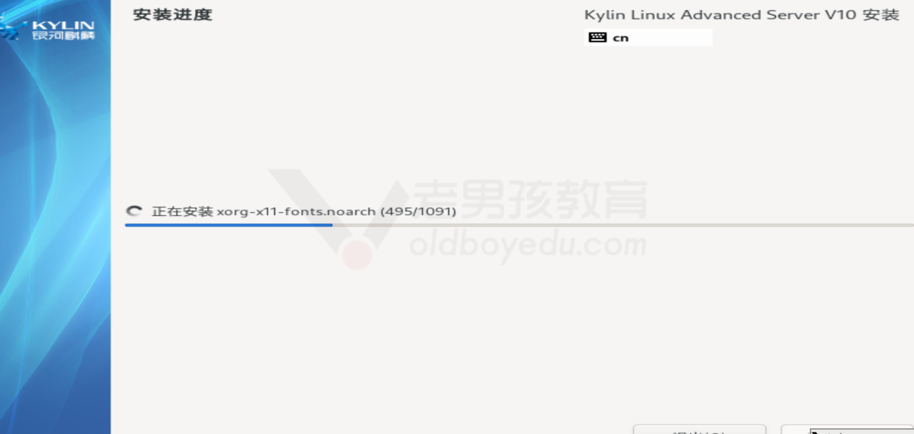
  - 依次按键1-->2-->c-->c(授权成功)
    
  - 最好root+密码登录成功
    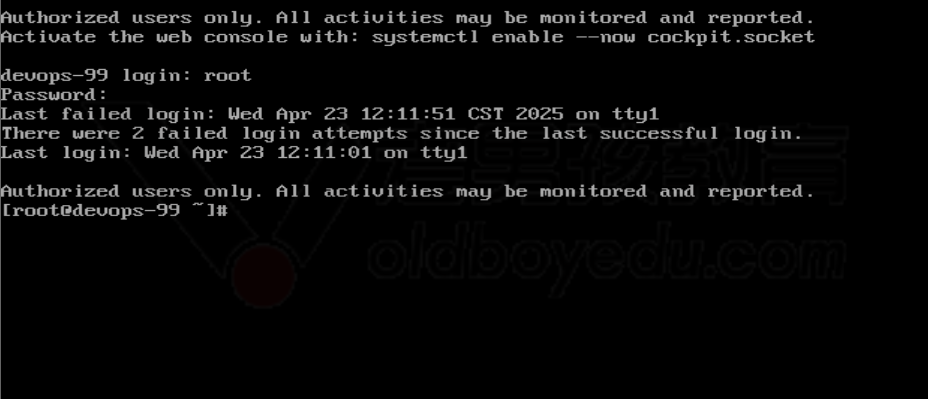

### 2.2 创建虚拟机

- 相当于从0购买一个服务器/物理机

### 2.3安装麒麟系统

点击屏幕鼠标不见了可以按ctrl+alt键返回到电脑桌面

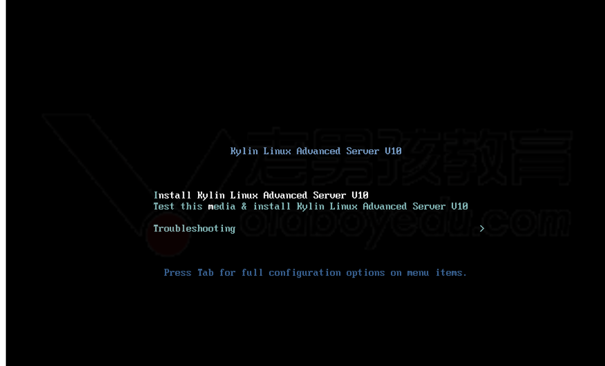


## 3.远程连接

### 3.1 远程工具

服务器如何操作:

| 连接类型 | 热点                                                         | 应用场景                                      |
| -------- | ------------------------------------------------------------ | --------------------------------------------- |
| 本地连接 | 直接在对应的长裤直接操作服务器(linux系统)                    | 未来系统有故障可以直接操作,一般用于拍错       |
| 远程连接 | 通过工具连接到虚拟机上进行操作,这样省去了人力跑去机房操作的成本. | 在工位远程服务器进行操作,可进行复制粘贴等操作 |


远程工具分类:

| 远程工具  | 版本         |      |
| --------- | ------------ | ---- |
| xshell    | 8.0,小白使用 |      |
| tabby     | 简单易用     |      |
| MobaXterm | 使用人群很多 |      |
|           |              |      |

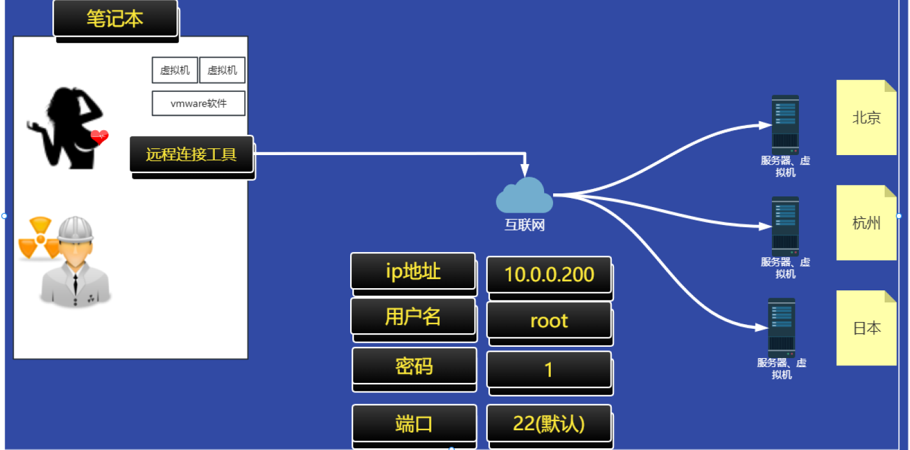

### 3.2 连接操作(我使用的工具tabby,基础操作懒得写了)

根据IP主机名连接后输入ip a检查网络配置是否正确

```bash
[root@fz ~]# ip a
1: lo: <LOOPBACK,UP,LOWER_UP> mtu 65536 qdisc noqueue state UNKNOWN group default qlen 1000
    link/loopback 00:00:00:00:00:00 brd 00:00:00:00:00:00
    inet 127.0.0.1/8 scope host lo
       valid_lft forever preferred_lft forever
    inet6 ::1/128 scope host 
       valid_lft forever preferred_lft forever
2: ens33: <BROADCAST,MULTICAST,UP,LOWER_UP> mtu 1500 qdisc fq_codel state UP group default qlen 1000
    link/ether 00:0c:29:3c:cf:7d brd ff:ff:ff:ff:ff:ff
    inet 10.0.0.200/24 brd 10.0.0.255 scope global noprefixroute ens33
       valid_lft forever preferred_lft forever
    inet6 fe80::6f6f:2796:1f77:e567/64 scope link noprefixroute 
       valid_lft forever preferred_lft forever
[root@fz ~]# 
```

### 3.3连接报错排障

- 首先检查虚拟机的IP地址/DNS/网关地址

- vvmware虚拟网络的NAT网卡是否配置正确(如果不正确请按照最开始的安装步骤重新看一遍)

- 远程工具配置虚拟机IP等信息是否正确，可以使用指令`ip a`查看，也可使用`nmtui`指令在图形界面操作

- 3.检查电脑本地服务中的几个VM服务是否都启动并正常运行(windows+r随后输入services.msc然后按v键定位到这几个服务)
  

- 最后一种是卸载重装,注意需要在QQ群文件中选择常用工具集合-->选择让你安装再安装-->清理由于之前卸载vmware不干净的残留后重新安装vmware

  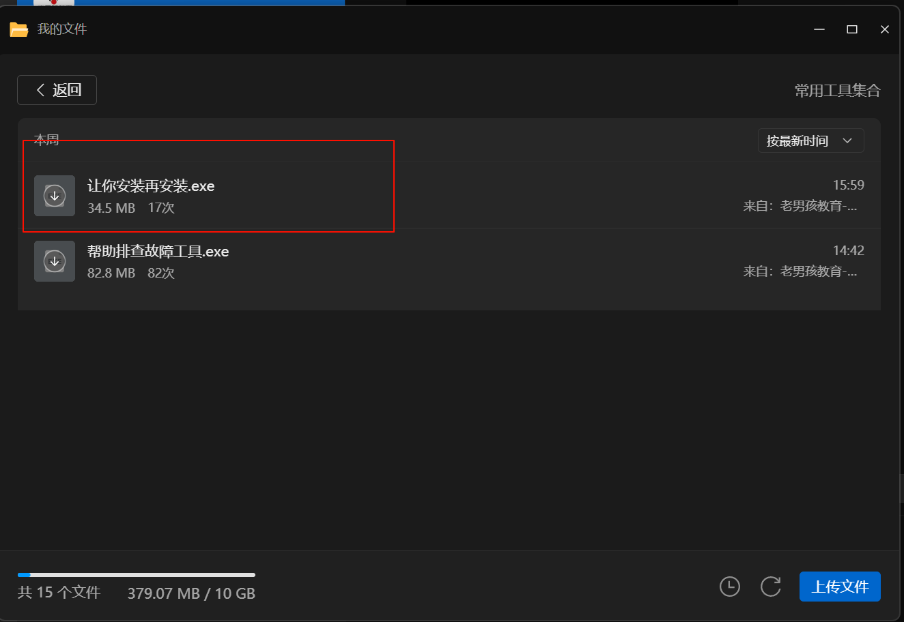

- **小技巧**：新建虚拟机的话建议名字后面加上v2/v3往上以此类推，表明每次建的是一个新版本，当然了IP也随之往后推移，比如之前是10.0.0.200，那下一个就是0.201

## 4.今日总结

- 张三一天的内容
- 常用linux发型版本与选择
- 物理机.虚拟机.云服务器区别
- 创建虚拟机麒麟kylin


- 课后任务:
  - 总结上面内容