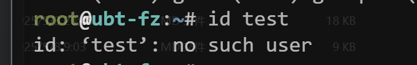

## 1、日常工作总结

### 1.1、上周工作总结


### 1.2、今日工作内容

- 如何创建包含时间的文件，目录或压缩包
- 用户的增删改查
- /etc/passwd
- sudo
- 堡垒机
- MD5校验与aide


## 2、创建包含时间的数据文件

### 2.1、``反引号优先执行

1. **使用反引号``或$()，功能相同**

2. **优先执行反引号内的命令，把输出保留下来，然后再执行创建的命令，最后组装在一起生成新的文件**

```sh
# 创建文件
touch lidao-`date +%F-%T`.txt
# 创建目录
mkdir test-`date +%F-%T`
```

### 2.1、创建压缩包

```sh
tar zcvf log-`date +%F`.tar.gz /var/log/
```

 

## 3、用户管理

### 3.1、用户的相关文件

| 用户相关的文件 | 说明                         | 备注                                                         |
| -------------- | ---------------------------- | ------------------------------------------------------------ |
| `/etc/passwd`  | 用户信息文件                 |                                                              |
| `/etc/shadow`  | 密码信息文件                 | 哪些用户有密码，第2列是*或!没有密码，第xx列：99999密码过期时间<br /> |
| `/etc/group`   | 用户组信息                   | 用户组包含了那些用户                                         |
| `/etc/gshadow` | 用户组密码信息（几乎用不到） |                                                              |


>1. UID User ID 身份证号码.系统识别的是用户UID. <==我们主要关注
>2. GID Group ID 用户组ID,户口本ID  

### 3.2、用户分类

| 分类     | UID              | 备注                                                         |
| -------- | ---------------- | ------------------------------------------------------------ |
| root     | 0                | 权限最高，超级管理员                                         |
| 虚拟用户 | 参考uid范围1-999 | 1. 看命令解释器是否为/bin/bash，不是一般用户就是虚拟用户<br />2. 让服务/软件正常运行所需的用户<br />3. 这类用户无法登录系统 |
| 普通用户 | uid1000+         | 日常使用的用户，可以远程登录与执行命令<br />权限受限，没有root权限高 |


### 3.3、用户的增删改查⭐⭐⭐

#### 3.1.1、增

**⚠️只可以创建普通和虚拟用户**

| useradd选项 | 说明                                                         |      |
| ----------- | ------------------------------------------------------------ | ---- |
| `-s`        | **指定命令解释器/bin/bash  /sbin/nologin<br />红帽类系统中,默认/bin/bash ubt/debian命令解<br/>s<br/>释器默认是/bin/sh(/bin/dash)** |      |
| `-m**`**    | **创建家目录(红帽类系统中,默认创建,ubt/debian/没有创建需要加上-m)** |      |
| `-u`        | **指定uid和gid**                                             |      |
| `-M`        | **不创建家目录**                                             |      |


```sh
# 1.增加用户
useradd 用户名
# 2.修改重置密码
passwd 用户名
# 3.切换用户
su - 用户名
# 4.检查当前用户
whoami
# 5.退出用户返回到root用户
ctrl+d

```

>**⚠️温馨提示：**
>
>ubantu/debian添加useradd添加用户时候默认不创建家目录，命令解释器也不是`/bin/bash`
>
>```SH
>useradd -s /bin/bash -m test1
>```

| 用户相关 命令 | 说明                                                         |
| ------------- | ------------------------------------------------------------ |
| `passwd`      | 修改密码,默认修改当前用户密码.                               |
| `su -`        | switch user切换用户 -相当于是-l,--login选项: 切换用户的时候更 新用户信息(变量 ) |
| `whoami`      | 显示当前用户名字                                             |

添加虚拟用户(不创建家目录,命令解释器/sbin/nologin)mysql,uid1999,

```sh
#1.检查1999uid是否使用
grep '1999' /etc/passwd
#2.检查mysql是否存在
grep 'mysql' /etc/passwd
#3.添加虚拟用户
useradd -s /sbin/nologin -M -u 1999 mysql
```


#### 3.1.2、查

| 查看用户信息 类命令 | 说明                                            |
| ------------------- | ----------------------------------------------- |
| `whoami`            | 用户名                                          |
| `id`                | 查看用户信息(uid,用户组信息),检查用 户是否存在  |
| `w`                 | 查看哪些用户登录了,正在干啥,平均负 载           |
| `last`              | 查看用户的登录情况(什么时间,从ip登 录)          |
| `lastlog`           | 查看所有用户最近1次登录情况(什么 时间,从ip登录) |


##### 3.1.2.1、用户巡检案例  

```sh
#1.统计系统一共有多少用户
wc -l /etc/passwd
#2.统计可以登录用户 /bin/bash
grep '/bin/bash' /etc/passwd|wc -l
#3.统计下其他用户数量
grep -v '/bin/bash' /etc/passwd|wc -l
#4.统计下用户数量
w #
5.统计指定用户的登录ip (root)
lastlog |grep root
```


#### 3.1.3、改

##### 3.1.3.1、修改用户密码⭐⭐⭐⭐⭐

1. 非交互式更改密码

```sh
#红帽类系统专用
echo 'Lidao996' |passwd --stdin oldboy	#--stdin从管道获取密码


#ubt/debian , 红帽 通用
创建密码文件(文件内容)
用户名1:密码
用户名2:密码
用户名3:密码
用户名4:密码
用户名5:密码
用户名6:密码
chpasswd命令
[root@devops-99-ubt ~]# cat pass.txt
oldboy:1
lidao:2
# 修改密码
[root@devops-99-ubt ~]# cat pass.txt | chpasswd
```

##### 3.1.3.2、修改用户信息(基本不用)  

useradd 添加用户的时候指定的信息,基本上都可以后期修改

```sh
usermod  
```

#### 3.1.4、删

##### 3.1.4.1、**userdel**

+ `userder r`彻底删除用户包括其普通用户家目录（非必要不要删除数据）

```sh
userdel test
```

##### 3.1.4.2、删除用户保险步骤

1. 首先在`passwd`配置文件中注释用户
   
2. 再去查询用户时发现找不到了
   
3. 等过去一个月后再`userdel`删除用户
4. 这样是避免误操作误删除


### 3.4、sudo⭐⭐⭐⭐⭐

- **背景：**

  - linux系统每个用户都是root不安全
  - 使用linux每个人1个用户，普通用户，权限不足

  

- **需求：** 普通用户可以临时以root权限运行指定的命令
- **实现：**
  - sudo给普通用户配置的以root权限运行命令功能
  - sudo类似于古代皇帝给大臣尚方大宝剑

- **使用：**
  - root权限
  - 普通用户使用sudo+命令

```sh
sudo su - 切换root
```

#### 3.4.2、root授权普通用户权限

>1. visudo 相当于vi /etc/sudoers 推荐使用visudo
>2. 到100行下面一行写入内容（100+G键）

- 授权test用户以root权限运行cat、less、head、more、grep  

```sh
#1.root授权

格式:
用户名 ALL=(ALL) 命令
test ALL=(ALL) /bin/cat, /bin/less, /bin/more, /bin/tail, /bin/head, /bin/grep

#2.切换到lidao996用户测试
sudo cat /etc/shadown
```


#### 3.4.2、root授权并免密登录

```sh
# root授权
lidao996 ALL=(ALL) NOPASSWD: ALL
# test测试
sudo su - #切换到root
```

#### 3.4.3、visudo无法退出故障解决

ctrl +x +y 回车

## 今日工作总结

- ``反引号使用创建带有日期的文件、目录、压缩包
- 用户的增删查指令与修改用户密码指令/核心
- sudo配置与使用(红帽系统)  

