## 1、今日工作内容

- 进程管理
- 系统负载评估


## 2、进程管理

### 2.1、进程

- 软件：安装软件（软件、服务、命令）存放在硬盘
- 进程：运行起来的软件就是进程，在内存中运行
- 守护进程/服务：一直运行的进程

**如何查看进程**：

```sh
w
pstree # 进程树
pstree -p #查看更多进程树
```


### 2.2、僵尸进程

#### 2.2.1、概述


> 1. 异常进程
> 2. 进程因为一些原因脱离**系统控制**没有正常退出结束并且在运行中无法控制
> 3. 占用系统的资源（内存、cpu资源）
> 4. 僵尸进程要及时排查与处理，否则僵尸进程增多会导致大量的资源被占用，系统负载增高

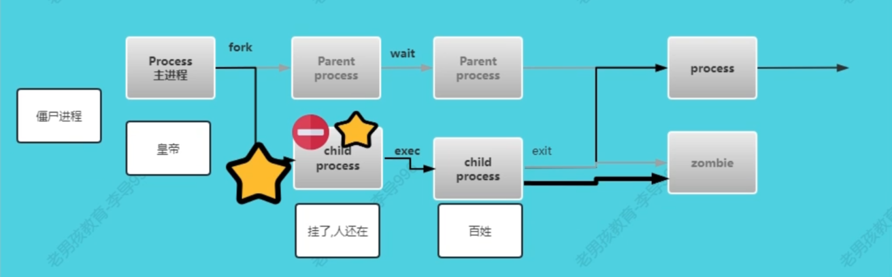

#### 2.2.2、处理

> 一般命令kill，甚至kill -9强制结束进程，一般是失效的
>
> 解决方案
>
> ​	
>
> 结束僵尸进程的上级进程
>
> 🅰️如果僵尸进程的上级进程是主进程,则只能重启Linux.(业务低谷期，在凌晨夜深人静的时候)  
>
> 🅱️如果僵尸进程的上级进程不是主进程(pid1),则通过kill命令结束即可. *


#### 2.2.3、查看

> 通过命令查看系统中是否有僵尸进程?
> 通过命令查看哪个进程是僵尸进程?

##### 案例01: 查看系统中是否有僵尸进程

```sh
top命令
# 第2行的最后 zombie
```

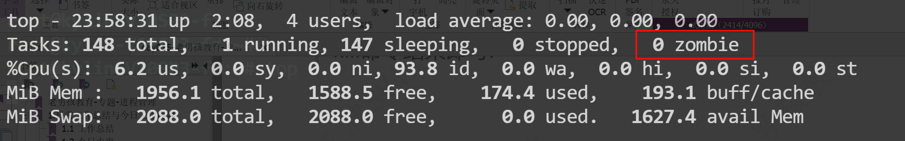

##### 案例02: 过滤出系统僵尸进程

```sh
ps aux |grep Z
```

**`ps aux`命令结果中给进程加上了状态信息,状态信息是`Z`表示僵尸进程**  

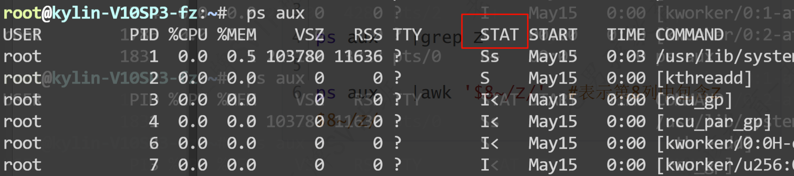

```sh
ps aux |awk '$8~/Z/' #表示第8列中包含Z	$8~/Z/
```


#### 2.2.4、模拟僵尸进程

```sh
gcc zombie.c -o zombie #-o 生成指定的二进制，模拟僵尸进程
#文件 命令
#前台运行
./zombie
#后台运行
./zombie &

```

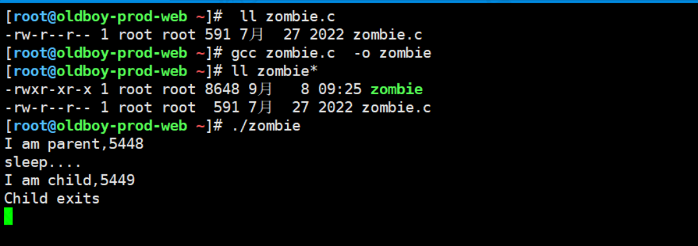

排查与结束僵尸进程全流程: ⭐⭐⭐⭐⭐  

```sh
#1.检查是否有僵尸进程
top
#2.查看哪个进程是僵尸进程
ps aux |grep Z #记录下pid
#3.查看僵尸进程上级进程
pstree -p 直接看即可 或ps -ef看第3列
#4.如果上级进程不是主进程
则通过kill + pid结束进程
#5.检查僵尸进程数量
```

- 说出什么是僵尸进程.
- ⭐⭐⭐⭐⭐会通过top,ps命令检查是否有僵尸进程,具体哪个是僵尸进程
- ⭐⭐⭐⭐⭐会解决僵尸进程  

### 2.3、特殊进程-孤儿进程

> 对系统影响不大.
> 某个子进程的父进程,因为特殊原因退出了,但是子进程还在.子进程就是孤儿进程.
> 检查:事前列好你要监控的服务,通过pstree -p 或ps -ef	
>
> 解决: 重启服务  

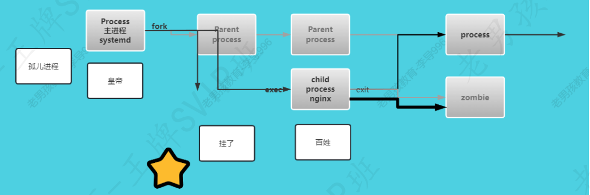

### 2.4、特殊进程小结

- 必会核心：僵尸进程,检查与解决
- 理解孤儿进程是什么  

### 2.5、进程管理

#### 2.5.1、kill系列-三剑客⭐⭐⭐⭐⭐  

| 杀手        | 说明                                                         |
| ----------- | ------------------------------------------------------------ |
| `kill`⭐⭐⭐⭐⭐ | `kill+pid` 进程号结束对应的进程<br /> `kill -9` 强制结束进程(-9是一种信号) |
| `pkill`⭐⭐⭐  | 根据进程名字过滤与结束， 取你狗命 (你和狗) 注意误杀          |
| `killall`   | 根据进程名字、或者指定用户                                   |

```sh
进程 sh /oldboy/lidao.sh #运行脚本 进程
推荐获取pid,kill + pid
pkill sh #这个命令运行后会结束? sshd
```

#### 2.5.2、后台运行⭐⭐⭐⭐⭐

- 区别:
  - 前台运行：命令在前台命令行运行，此时无法进行其他操作，需要等待执行完成后再执行其他命令
  - 后台运行：一些命令在前台运行的时候连接断开了或网络断开，前台运行的命令会结束，后台运行的则没有影响
  - & and(俺的)  

| 后台运行                     | 说明                                                         |
| ---------------------------- | ------------------------------------------------------------ |
| 命令或脚本 &⭐⭐⭐⭐             | 后台运行，连接断开也结束                                     |
| **nohup 命令或脚本 &** ⭐⭐⭐⭐⭐ | 后台运行，连接断开也不结束，默认会把命令/脚本输出写到nohup.out文件中。 |
| 其他命令screen 命令          |                                                              |

- **输出到nohup.out文件**  

```sh
#1.后台运行
nohup ping jd.com &
[1] 2842
nohup: 忽略输入并把输出追加到'nohup.out'
#2.检查
tail -f nohup.out
```

- **指定输出文件**

```sh
nohup ping jd.com >/oldboy/ping-jd.log &
/oldboy/ping-jd.log 日志文件,记录命令输出.(正确输出)
```


### 2.6、进程监控命令⭐⭐⭐⭐⭐

- **`ps` 查看进程静态信息**
- **`top` 查看进程动态，静态信息**

#### 2.6.1、ps

- **`ps -ef` 与`ps aux`**  

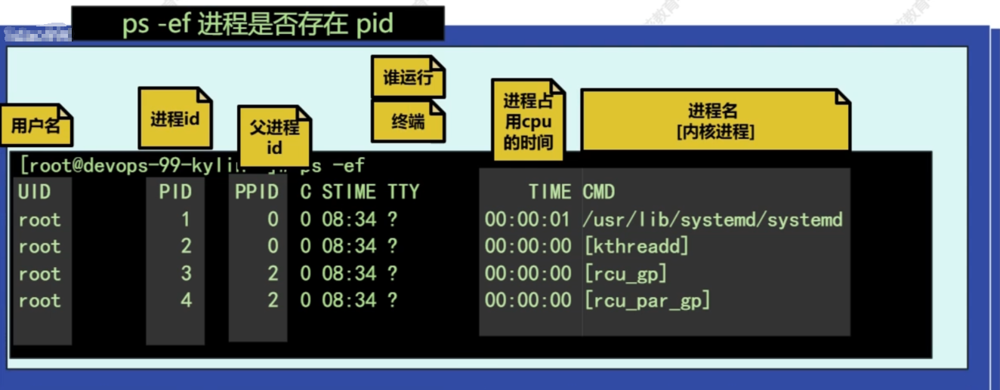

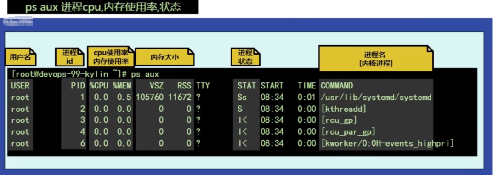

- VSZ 和 RSS  

>1. `swap`是什么?
>     交换分区(虚拟内存)：物理内存不足的时候，swap临时充当内存，防止系统崩溃
>
>2. `VSZ/RSS` 单位kb
>     vsz眼中系统内存总大小: `swap`+物理内存总和
>     `VSZ virutal size`虚拟大小=`swap`+物理内存
>
>3. `RSS` 表示实际物理内存大小


- **进程状态**

| 名称           | 作用                                                         |
| -------------- | ------------------------------------------------------------ |
| `Z===zombie`   | 僵尸进程：已终止但未被父进程回收（需清理）。占用少量内核资源。 |
| `R===running`  | 正在运行或就绪                                               |
| `S===sleeping` | 可中断的等待休眠（等待事件完成，如信号或资源可用）。可通过信号唤醒。 |
| `D`            | 不可中断的进程，一般指的是io进程（input/output读写）         |
| `T`            | 后台挂起（暂停）状态的进程（ctrl+z快捷键导致在挂起，可通过 `fg[前台运行]/bg[后台运行]` 恢复。）<br />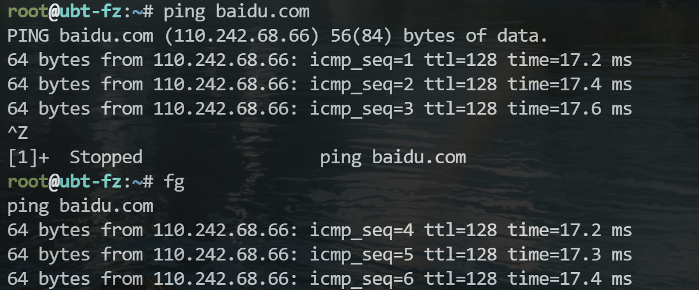 |

| **I** | **Idle Kernel Thread**          | 空闲的内核线程（极少出现在用户进程）。              |
| ----- | ------------------------------- | --------------------------------------------------- |
| **t** | **Stopped by Debugger**         | 被调试器（如 `gdb`）在跟踪期间暂停。                |
| **W** | **Paging (Obsolete)**           | 分页中（自 Linux 2.6 内核后无效，不再使用）。       |
| **X** | **Dead (Should Never Be Seen)** | 进程已死亡（通常瞬间退出，`ps` 不应捕获到此状态）。 |
| **Z** | **Zombie (Defunct)**            | 僵尸进程：                                          |


- 辅助符号

| 符号 | 作用                                                         |
| ---- | ------------------------------------------------------------ |
| `+`  | 前台运行的进程                                               |
| `s`  | 带有小`s`的表示进程的主进程（父进程、管理进程）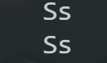 |
| `l`  | 带有小`l`的表示该进程支持线程<br />1. 进程：`Process`进行的程序或软件就相当于是1个进程，有的软件支持多线程技术，进程就相当于工厂<br />2. 线程：`Thread`线程就相当于工厂里面的多个工人，负责处理请求 |

- 组合

| 名称  | 作用                |      |
| ----- | ------------------- | ---- |
| `R+`  | 前台运行中          |      |
| `S+`  | 前台运行，未占用CPU |      |
| `Ss`  |                     |      |
| `Ssl` |                     |      |
| `Z`   | 僵尸进程            |      |

#### 2.6.2、top

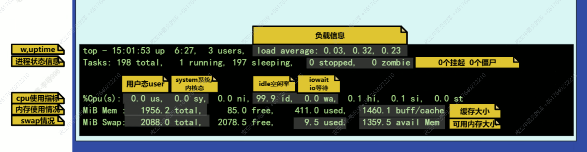

##### top命令快捷键

| 快捷键           | 作用                      |
| ---------------- | ------------------------- |
| `M`              | 以内存使用率排序          |
| `P`              | 返回cpu使用率排序         |
| `空格`           | 刷新                      |
| `1`              | 显示所有核心的cpu使用情况 |
| `z→x→>或<调整列` | 显示颜色                  |
| `htop`           | 美观版，可以鼠标点击      |

```sh
%Cpu(s):  0.7 us,  0.7 sy,  0.0 ni, 97.7 id,  0.0 wa,  0.7 hi,  0.3 si,  0.0 st

0.0 ni 	nice 高优先级进程占用的cpu	进程状态中带有“<”的进程
0.7 hi	hard 硬件中断
0.3 si	soft 软件中断
0.0 st	steal 虚拟机的pcu被其他虚拟机或所主机抢占的时间或被占用的时间	（与虚拟化有关 ，宿主机，虚拟机[kvm。。。。。]）
```


#### 2.6.3、ps与top应用案例 ⭐⭐⭐⭐⭐  

##### 2.6.3.1、过滤出叫crond的进程或sshd的进程

```sh
ps -ef |egrep 'crond|sshd'
细节:
ps -ef |grep
crond
root 942 1 0 02:40 ?
00:00:00 /usr/sbin/crond -n
root 17838 8140 0 14:39 pts/3
00:00:00 grep --color=auto crond

# grep命令执行的时候grep也是一个进程,自己过滤出来了
```


##### 2.6.3.2、统计crond进程数量  

```sh
数量-->进程是否运行
>=1 有这个进程,运行中.
0 没有进程,没有运行
grep命令执行的时候grep也是一个进程,自己过滤出来
了.
#crond运行中
ps -ef |grep crond |wc -l
#关闭crond
systemctl stop crond
#crond停止后
ps -ef |grep crond |wc -l
#grep排除选项
grep 'root' /etc/passwd
grep -v 'root' /etc/passwd
#精确过滤crond进程数量
ps -ef |grep crond |grep -v 'grep'
ps -ef |grep crond |grep -v 'grep' |wc -l
#扩展进阶写法
ps -ef |grep '[c]rond' | wc -l
```


##### 2.6.3.3、输出rsyslog进程的pid

```sh
第1步:执行命令,ps -ef
第2步:取行,过滤rsyslog行
第3列:取列,awk
ps -ef |grep rsyslog |grep -v grep |awk
'{print $2}'
```


##### 2.6.3.4、top命令非交互模式与过滤指定内容  

```sh
对top命令的结果进行取行与取列.
top命令默认是交互模式便于展示结果,但是不方便进行过
滤或二次加工.
top命令变成非交互模式.
top -bn1
-b 显示所有信息,不要仅仅显示头部信息和部分的进程信
息.
-n1 显示1次.
top -bn1 |grep 'zombie' |awk '{print $(NF-3）}'
```

##### 2.6.3.4、案例:取出系统登录用户数量

```SH
top -bn1 |awk 'NR==1' |awk '{print$(NF-6)}'
top -bn1 |awk 'NR==1{print $(NF-6)}]'
```


##### 2.6.3.4、取出僵尸进程数

```sh
top -bn1 | awk 'NR==2{print $(NF-1)}'
```

2.6.4、小结

- ps,top核心内容(pid,ppid,cpu使用率,内存使用率,VSZ,RSS)
- 进程状态.Z,R,D,T
- ps,top与三剑客进行过滤
- 统计次数
- 取行取列  

### 2.7、系统负载

#### 2.7.1、负载

>1. 衡量负载繁忙的程度的指标
>
>2. 处于运行状态（R/S/CPU）的进程数量、不可以中断（D io）的进程数量
>
>3. 负载高就是如果核心数为4个，系统负载高的值接近或超过cpu核心总数

#### 2.7.2、系统负载高

**负载高常见原因：**

- **占用系统cpu过多导致的负载高**
- **占用磁盘IO过多导致的负载高**

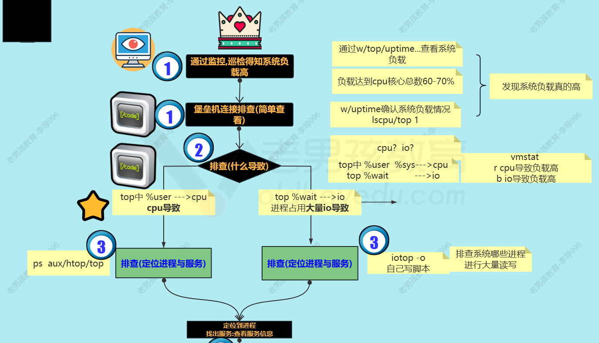

- **`top` 查看cpu负载情况**

- **`iotop` 查看io负载情况**

- **`iotop` 只查看正在运行的进程**

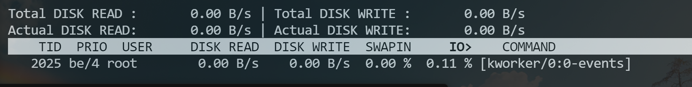

#### 2.7.3、模拟负载高

- **stress压力测试cpu负载高（类似于电脑跑分）**

```sh
yum install -y stress

#测试cpu导致负载高
tress --cpu 8 --timeout 1000s
```

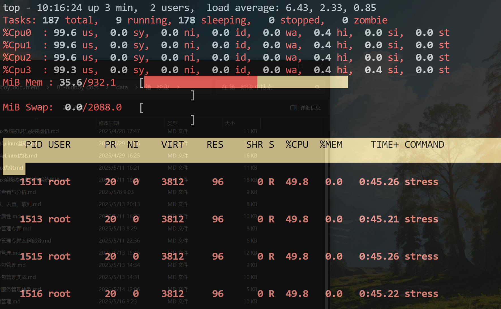

- 测试io负载

  ```sh
  stress  --io 6 --hdd 10 --hdd-bytes 1g --timeout 1000s
  ```

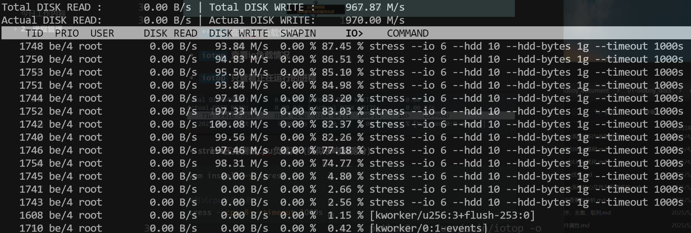

#### 2.7.4、小结

核心排查流程：

- 检查是是否高
- 定位到cpu、io
- 定位具体进程

## 3、工作总结

- 僵尸进程排查与处理
- kill,pkill
- &, nohup 命令 &
- ps,top 核心组成与内容
- ps,top案例过滤
- 进程状态
- swap  
- 系统负载


