## 1、工作内容

- 磁盘基础知识点
- 磁盘使用流程
- 面试题：raid（物理服务器）
- swap关闭，开启增加
- 磁盘分区方案
- 磁盘空间不足
- 紧急救援模式
- 文件系统只读
- 故障案例磁盘空间不足系列


## 2、磁盘管理

### 2.1、磁盘

- 磁盘/硬盘：永久存放数据
- 内存：临时。程序软件运行的地方
- 分类为机械硬盘HDD（速度慢）和固态硬盘`SSD`（速度快价格高 ）


- 磁盘分类 

| 磁盘接口  | 硬盘               | 大小                                                         |
| --------- | ------------------ | ------------------------------------------------------------ |
| `sata`    | 机械硬盘，固态硬盘 | 4tb大小 10k转 性能要求不高的地方（备份使用）                 |
| `sas`     | 机械硬盘，固态硬盘 | 机械900G 15k转 性能会快一些，转速高性能就会好，企业使用      |
| `pcire-e` | 固态硬盘           | tb级别。3tb 4tb 8tb硬盘 关键地方使用,性能,容量不高地方.<br />数据库,存储服务 |

- 固态盘颗粒
- 存储颗粒：lsc mlc tlc xxxx 3d nand

### 2.2、磁盘性能指标


| 指标               | 机械硬盘       | 固态硬盘     |
| ------------------ | -------------- | ------------ |
| 容量               | 硬盘空间大小   | 硬盘空间大小 |
| 缓存               | 越大越好       | 越大越好     |
| 吞吐量（极限速度） | 600MB~1200MB/s | 更高         |
| 顺序读取速度       |                |              |
| 顺序写入速度       |                |              |
| 随机读取次数 iops  |                |              |
| 随机写入次数 iops  |                |              |
| 延迟               |                |              |

```bash
iops 每秒的io次数 衡量随机读写

顺序读写 一般就是买硬盘标记的速度
```


```sh
#1.dd命令 简单测试


#2.专业工具 fio
```


### 2.3、磁盘使用流程

- **已经安装好的系统**
- **磁盘分区**
- **磁盘格式化**
- **磁盘挂载，永久挂载**

| 使用流程       | 说明                       | 对比                       |
| -------------- | -------------------------- | -------------------------- |
| **磁盘分区**   | **对硬盘创建多个分区**     | **一间房子，划分卧室客厅** |
| **磁盘格式化** | **给磁盘分区创建文件系统** | **给房间进行装修**         |
| **挂载**       | **给磁盘分区设置入口**     | **给房间安装门窗**         |

```sh
#1.硬盘基本规则
硬盘命名规则，块文件 b（block）
sas、sata、scsi接口>> /dev/sd开头
虚拟化（kvm、openstack），云服务器 /dev/vdxxxx
固态硬盘（物理服务器）			/dev/nvmexxx

第一块硬盘：sda
第二块硬盘：sdb

#2.分区命名 mbr分区表格式化
分区号1-4 主分区或逻辑分区
逻辑分区从5开始

第一个分区	/dev/sda1
第二个分区	/dev/sda2
第三个分区	/dev/sda3
```


#### 2.3.1、分区

```sh
#1.指定硬盘
fdisk /dev/sdb

#2.查看分区信息
输入p查看分区信息

#3.创建100MB的主分区
n创建磁盘分区
默认使用p（主分区）	回车即可
分区数字默认是1	 回车即可
第一个				回车即可（默认的开始）
最后1个			输入+100M
完成后p查看分区情况

#4.创建扩展分区
n 创建磁盘分区
e 创建扩展分区
默认开始--->结束（把所有空间给扩展分区）

#5.创建200MB的逻辑分区
n 直接就是创建逻辑分区
默认开始 回车即可
结尾分配空间 ：+200M

#6.保存退出
w 写入磁盘保存退出

#7.检查
ll /dev/sdb*
fidsk -l | grep "dev/sdb"
```

|               指令                |       作用说明       |
| :-------------------------------: | :------------------: |
|          **`fdisk -l`**           |   **查看分区列表**   |
| **`fdisk /dev/xxxx（硬盘名字）`** |     **创建分区**     |
|        **`p（ print ）`**         | **输出磁盘分区信息** |
|          **`n（new）`**           |     **新建分区**     |
|       **`n（add a new ）`**       |  **创建一个新分区**  |
|         **`q（quit ）`**          |  **不保存更改退出**  |
|      **`w（wirte quit ）`**       |  **写入磁盘并退出**  |
|         **`d（delete）`**         |     **删除分区**     |


------


```sh
mbr磁盘分区知识点深入：理解这三个分区关系即可
主分区最多4个
某1个主分区的位置，创建扩展分区，扩展分区无法直接使用，需要在扩展分区中创建逻辑分区

磁盘分区信息存放在磁盘的开头的：0头0道1扇区（机械硬盘组成），1分区大小 512字节
```


#### 2.2.2、格式化

- **Linux格式化也成为创建文件系统**
- **不同的文件系统相当于是不同的装修风格**


```sh
# 创建文件系统
make filesystem mkfs命令

# 参考系统已有的比如根分区
df -Th /

#创建文件系统（格式化）xfs格式
mkfs.xfs /dev/sdb1

#查看已经格式化的分区/文件系统
blkid
```

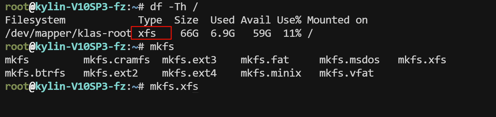


#### 2.2.3、挂载


- **没有挂载的硬盘分区无法使用**
- **挂载操作相当于给硬盘设置了入口**
-  **挂载点（入口）是一个目录（已经存在的空目录）**

```sh
# 把/dev/sdb1挂载到/mnt测试
# 挂载
mount /dev/sdb1 /mnt
#查看挂载情况
df -Th /mnt
```

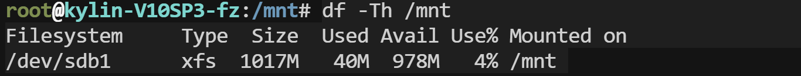

#### 2.2.4、卸载

```sh
umount /mnt

# 强制卸载，在挂载目录在使用状态并且无法退出挂载目录的情况
umount -lf /mnt
```


#### 2.2.5、永久挂载

- **mount是临时挂载，重启后失效**
- **需要配置永久挂载，需要根据需求创建目录/app/data**

```sh
#1.专业 /etc/fatab 开机自动挂载的配置目录
vim /etc/fatab

#1.1fstab每一列的作用
#第一列：指定文件系统（磁盘分区名字或者blkid获取UUID） /dev/sdb1
#第二列：挂载点									/app/data
#第三列：文件系统类型								  xfs
#第四列：挂载选项，一般使用默认					  defaults
#第五列：是否进行备份（dump指令）					   一般关闭
#第六列：是否进行开机自检（硬盘检查）					一般关闭
/dev/sdb        /app/data       xfs     defaults        0 0

#1.2更改自动挂载配置文件需要重启才能生效，所以配置完后想立刻使用可以配置临时生效
mount /dev/sdb1 /app/data


#2.使用/etc/rc.local 开机自动运行指定的命令
mount /dev/sdb1 /app/data
```


#### 2.4.6、`mbr VS gpt`

| 磁盘分区表 | 共同点                         | 区别                                      | 使用的命令   |
| ---------- | ------------------------------ | ----------------------------------------- | ------------ |
| `mbr`      | 引导系统启动，存放磁盘分区信息 | 主分区、扩展分区、逻辑分区支持硬盘小于2TB | fdisk/parted |
| `gpt`      | 引导系统启动，存放磁盘分区信息 | 主分区无限（100+）2TB以上                 | gdisk/parted |


```
parted 硬盘名字
#创建分区表
mktable gpt #或者使用mklabel
#创建分区
mkpart primary 0 100g #primary主分区0 开始 100g 结束

q	退出
rm id号	删除
p	查看
```


#### 2.4.7、机械硬盘的组成

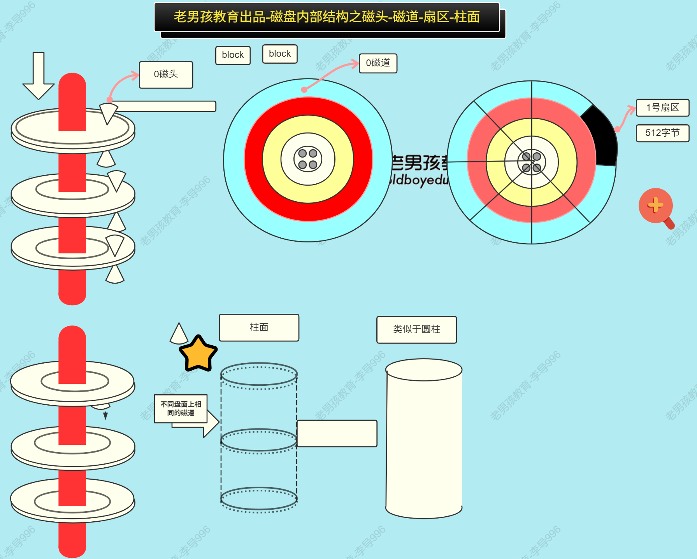


### 2.4、raid

- 物理服务器使用
- 负责管理多块硬盘
- 目标/特点：
  - 获取更高的容量
  - 获取更高的冗余(安全性)
  - 获取更高的性能

- raid通过物理设备：raid卡来实现，这个raid也叫阵列卡，不同的厂商有些区别

- raid管理这些硬盘的方式：raid级别 <=== 核心  


**raid级别和应用场景**

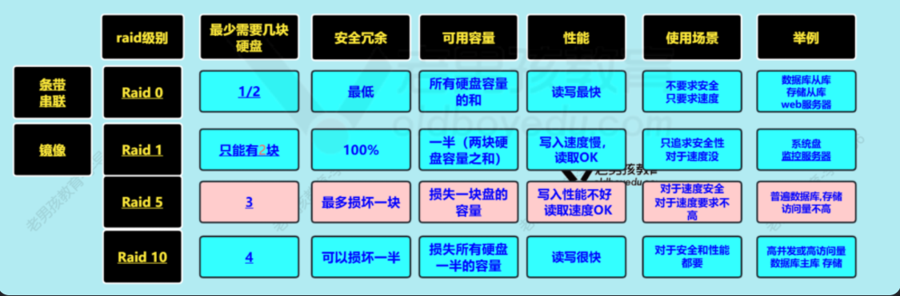


## 3、磁盘案例

### 3.1、磁盘分区

- linxu磁盘分区类似于windows的 C: D: E: F:盘
- 一切从根开始

| **常见方案**  | **说明**                                                     | **大小**                                 |
| ------------- | ------------------------------------------------------------ | ---------------------------------------- |
| **`/boot/`**  | **引导分区、引导系统启动，存放linux内核文件**                | **1G/2G**                                |
| **`/根分区`** | **存放软件包、安装服务、相当于是C盘**                        | **20G以上**                              |
| **`swap`**    | **特殊文件系统，没有挂载点<br />特殊环境中：数据库、存储、k8s环境推荐关闭swap<br />特殊需求：比如java可以配置swap** | **最多建议8G**                           |
| **`/data/`**  | **独立数据分区，名字与路径可以自定义，看需求，有重要数据再考虑** | **以上分区剩余的所有空间可以都给到data** |


### 3.2、物理服务器使用全流程

| 流程步骤                    | 说明                                                         | 补充 |
| --------------------------- | ------------------------------------------------------------ | ---- |
| **1️⃣验收、上电、进行配置**   | **机架式服务器**                                             |      |
| **2️⃣配置远程控制卡**         | **是一个物理设备，无法远程连接的备用方案，避免跑机房现场操作** |      |
| **3️⃣配置raid**               | **8块硬盘 2个raid1 6个raid5**                                |      |
| **4️⃣安装系统**               | **自定义分区：<br />raid1 /根分区 /boot /swap<br />raid5 /data/** |      |
| **5️⃣连接、基础优化配置**     | **命令行、软件包yum配置、ssh远程连接**                       |      |
| **6️⃣可选（配置，部署服务）** | **根据需求部署服务、配置**                                   |      |
| **7️⃣服务器上架**             | **将服务器放进机柜中，机柜放置在机房中（公司内部（测试），IDC数据中心机房（也可以租赁））** |      |


### 3.3、swap

> 1️⃣创建/增加swap
>
> 2️⃣关闭swap


#### 2.3.1、增加swap

**增加1g空间的swap，当前是否有swap都不影响你添加swap**

```sh
#1.创建目录
mkdir -p /data/

#2.使用dd创建1G空间swap文件
dd if=/dev/zero of=/data/1g bs=1M conut=1024

#3.格式化并赋权限
mkswap /data/1g
chmod 600 /data/1g

#4.挂载激活swap
free -h #查看挂载激活前的swap大小为2G
              total        used        free      shared  buff/cache   available
Mem:          932Mi       201Mi        59Mi       6.0Mi       670Mi       573Mi
Swap:         2.0Gi       7.0Mi       2.0Gi

swapon /data/1g #挂载激活

free -h	#查看开启swap后大小增加到3G
              total        used        free      shared  buff/cache   available
Mem:          932Mi       202Mi        58Mi       6.0Mi       670Mi       572Mi
Swap:         3.0Gi       7.0Mi       3.0Gi


#5.永久挂载
vim /etc/fstab
#添加一行
/data/1g   none                    swap    defaults        0 0
```


#### 3.3.2、关闭swap

```sh
#关闭swap
swapoff -a

# 删除永久挂载，
vim /etc/fstab #注释掉swap的行
```

**⚠️ubt/debian系统，上面2个步骤外还要执行下面的命令**

```sh
systemctl mask swap.target
```


### 3.4、故障案例：root密码忘记重置

- 也适用于linux无法启动、错误修改/etc/配置导致无法启动
- 需要重启linux

#### 3.4.1、红帽类系统-救援模式

- **1️⃣重启后按e进入编辑模式（麒麟系统需要账号，账户：root，密码：Kylin123123⚠️*K是大写*）**
- **2️⃣找到`linux`开头的行**
- **3️⃣更改`ro`为`rw`**

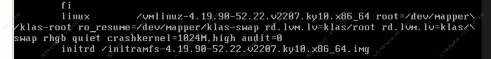

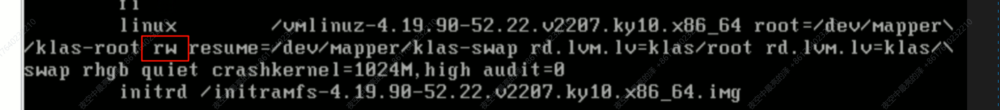

- **4️⃣到行尾增加`init=/bin/bash`**

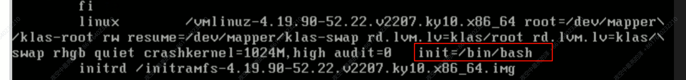

- **5️⃣`ctrl+x`启动进入单用户救援模式**
- **6️⃣`vim /etc/passwd`进入到用户信息配置文件中，删除掉`root`的密码标记`x`**

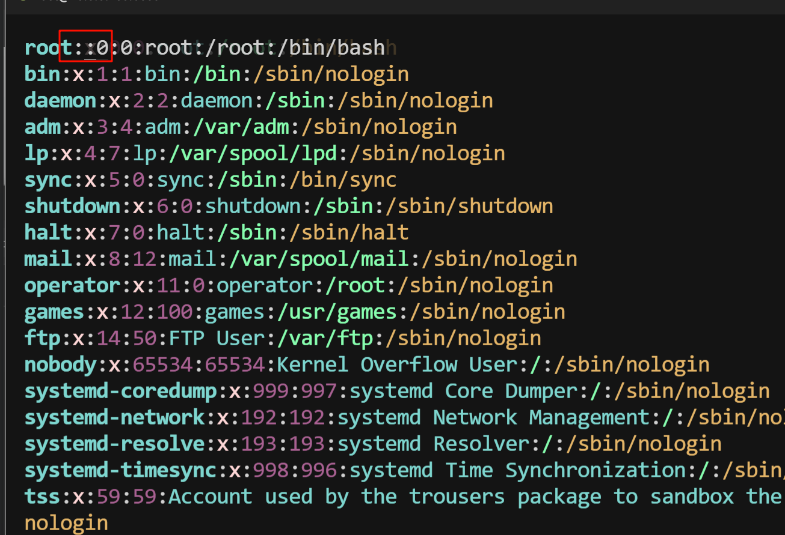

- **7️⃣修改完成后重启，重启后记得配置root密码，否则无法ssh远程连接**


#### 3.4.1、红帽类系统-光盘/U盘救援模式

- **针对linux无法七期了，grub菜单都无法进入**

- **主要是抢救数据**

**1️⃣重启linux，以光盘/U盘启动，logo页面时按esc键（或F12/F10，具体以提示为准）**

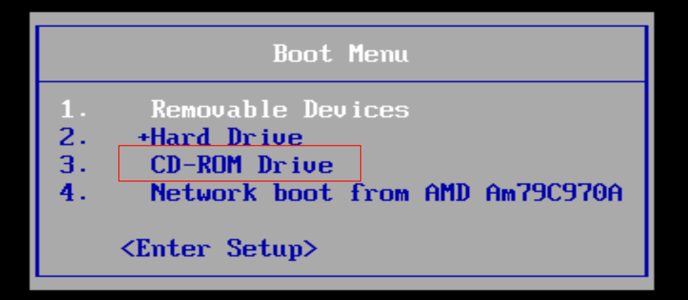

**2️⃣选择光盘/U盘启动，进入到安装页面**

3️⃣选择troubleshiiting然后选择rescue

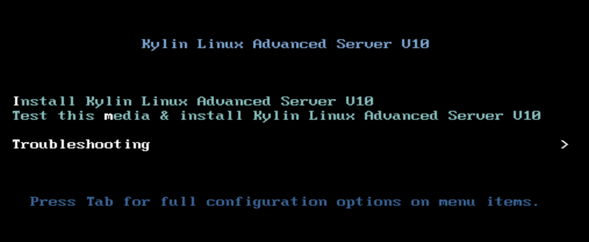


4️⃣进入系统，然后挂载本地硬盘的根到当前环境中，再进行下面操作

5️⃣`mount  /dev/硬盘分区   /mnt`

```sh
fdisk -l |grep root #查询/分区的名称
mount /dev/mapper/klas-root /mnt #挂载/分区到/mnt下
df -Th	#查看挂载情况
vim /etc/passwd	#进入到用户配置文件删除root的密码标记x，然后重启
```

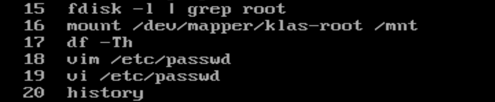


- 制作启动Linux的U盘（安装系统、进入救援模式）
  - https://www.ventoy.net/cn/  
  - 配置完成U盘后，复制镜像ISO文件到U盘
  - 通过U盘启动服务器


### 3.5、磁盘空间不足

**报错信息：`no space left on device`**

| 常见原因                                          | 排查                   | 如何解决                     |
| ------------------------------------------------- | ---------------------- | ---------------------------- |
| block 大文件较多                                  | df、du-sh              | 定位到文件或者目录，删除即可 |
| inode耗尽                                         | 找出系统中大目录       | 清理这个目录                 |
| 文件未彻底删除，日积月累导致磁盘空间不足（block） | lsof命令检查delete标记 | 定位到具体进程，重启服务即可 |

#### 3.5.1、inode

- 存放属性信息，inode数量格式化后固定
- 一般block使用多一些
- 因为某些特殊原因导致小文件占用inode
- 故障复现

```sh
#1.创建一个50MB的小分区
dd if=/dev/zero of=/data/50m bs=1M count=50
#2.格式化
mkfs.xfs /data/50m
#3.创建个目录，挂载
mkdir /inode/
mount /data/50m /inode/

df -i /inode	#查询inode数量

#4.创建文件与观察错误
cd /inode/
touch {1..25600}.txt
touch {01..500}.txt
#报错如下
touch: 无法创建 '0062.txt': 设备上没有空间
```

- 排查（在系统中找出大的目录）

```sh
mkdir test

touch test/{01..100000}

find / -type d -size +1M

find / -type d -size +10M
```


- 解决

  - find找出目录
  - 检查目录下是否有大量文件，不要使用tree、ls、ll，可以使用ls | wc -l
  - 确认后删除
  - 进行删除

  ```sh
  #1. |管道搭档xargs
  xargs参数转换 字符--->参数（字符--->文件目，目录名字可以呗命令识别）
  管道传递的是字符（awk、grep、sort、uniq）
  #2.报错Argument lisy too long
  #可以使用echo+touch/rm方式解决
  echo {01..1000000}|xargs touch
  
  #3.删除文件
  ls | xargs rm -f
  #文件量过大进行分批删除，字母开头，数字开头的
  ls *1 | xargs rm -f
  ls *2 | xargs rm -f
  #也可以删除文件所在目录，但需要记录目录的名字、所有者和权限，删除后可能需要重新创建（慎重操作）
  
  ```

  - **小结：**
    - **inode耗尽导致磁盘空间不足.**
    - **现象:提示磁盘空间不足了，df -h没有满,df -i查看满了**
    - **排查:找出系统大目录find / -type d -size +1M**
    - **解决: 确认后删除,目录下的小文件**
      - **🅰️`ls/find +|xargs rm` 删除**  
      - **🅱️删除文件所在目录(目录名字、目录所有者、权限)慎重**  
    - **补充：**
      - **与|xargs 区别**
      - **正常过滤取行取列，字符**
      - **xargs 传递参数(文件名，目录名字...)**  

#### 3.5.2、文件未彻底删除导致

- 场景：发现磁盘空间不足，排查日志文件导致的，删除这个文件

```
删除1个文件（1个文件被彻底删除条件） 文件删除原理
1.rm 命令删除 入口为0（硬连接数量为0）
2.未见被使用中（不能被使用，被占用中，怀疑是被某个进程服务使用，所以空间未被释放，一般是日志文件）
```

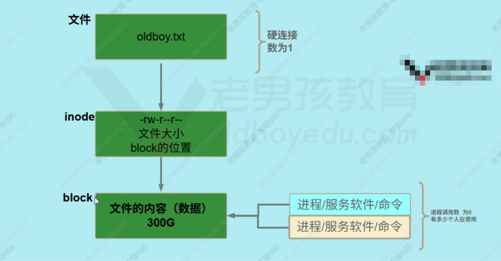


- **故障复现**

```sh
#1窗口1 创建大文件并使用tail占用
dd if=/dev/zero of=/var/log/big bs=1M
count=30000
tail -f /var/log/big
#2.窗口2
#删除这个文件观察 空间是否释放
```


- **排查**

```sh
#1.查看发现空间满了
df -Th
#对比空间差异
df -h 
du -sh /*
#找到占用空间大的是tail进程
lsof |grep delete 
#查找进程号
ps -ef|grep tail
#杀掉进程
pkill 进程号
```


- **解决**
  - **重启服务**


## **4、今日工作总结**

- **面试题：raid(物理服务器)**
- **磁盘使用流程：分区、格式化、挂载(永久挂载)**
- **mbr vs gpt区别**
- **fdisk、mkfs、mount、umount、-lf (强制卸载)**
- **df -hT**
- **blkid  查询分区UUID**
- **磁盘分区方案（创建自定义虚拟机跑流程）**
- **swap增加/关闭**
- **故障案例：进入救援模式，U盘进入救援模式**
- **故障案例：磁盘空间不足**
  - **经典**
  - **inode不足**
  - **未彻底删除不足的**


